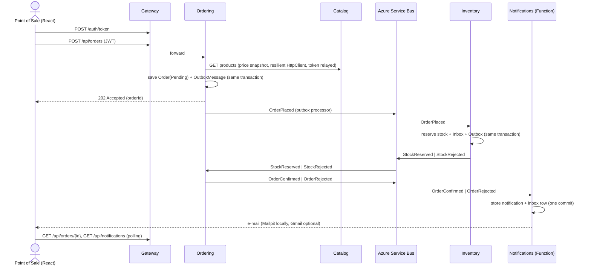

# microservices-demo

A B2B beer ordering platform, inspired by the BEES model, built as a small but production-minded
**.NET 10 microservices** system. A point of sale (a bar or a market) signs in, browses the catalog, places an order;
the stock is reserved in another service, the order is confirmed or rejected, and the outcome is recorded, shown in
a notifications panel and e-mailed.

The scope is an MVP built in about two days. It is small enough to explain in ten minutes and runs with a single
command, but every piece a real system needs to be trusted is there: a transactional outbox, idempotent consumers,
dead-lettering, resilience pipelines, token validation in every service, tests against a real database and CI.

> Catalog data is fictional (e.g. *Golden Lager 350ml*, *Amber Ale 600ml*), with one nod to a famous cartoon beer:
> *Duff-Style Classic Lager*.

Leia em português: [README_pt.md](README_pt.md).

## Contents

- [Architecture](#architecture)
- [The order flow](#the-order-flow)
- [How to run](#how-to-run)
- [Demo script](#demo-script)
- [Design patterns — where and why](#design-patterns--where-and-why)
- [Testing](#testing)
- [CI](#ci)
- [Repository layout](#repository-layout)
- [Documentation](#documentation)
- [Next steps](#next-steps)

## Architecture

```
React (Vite) ──► Gateway (YARP + JWT) ──┬─► Catalog API    ── PostgreSQL (catalogdb)
                                        ├─► Ordering API   ── PostgreSQL (orderingdb)
                                        ├─► Inventory API  ── PostgreSQL (inventorydb)
                                        └─► Notifications  ── PostgreSQL (notificationsdb)
                                              (Azure Function)

Azure Service Bus (emulator)
  topic order-events      ─ sub: inventory      (Subject = OrderPlaced)
                          ─ sub: notifications  (Subject = OrderConfirmed | OrderRejected)
  topic inventory-events  ─ sub: ordering       (Subject = StockReserved | StockRejected)
```

| Service | Style | Responsibilities | Endpoints |
|---|---|---|---|
| **Gateway** | Minimal host + YARP | Single entry point: reverse proxy, demo token issuing, JWT validation, CORS, rate limiting | `POST /auth/token`, proxies `/api/*` |
| **Catalog** | Vertical Slice | Beer products (SKU, name, style, volume, pack size, price) | `GET /api/products`, `GET /api/products/{id}`, `POST`/`PUT /api/products` (Admin) |
| **Ordering** | Clean Architecture + DDD | Order lifecycle, volume discounts, publishes and consumes events | `POST /api/orders`, `GET /api/orders`, `GET /api/orders/{id}` |
| **Inventory** | Service layer | Stock per SKU, all-or-nothing reservation | `GET /api/stock`, `PUT /api/stock/{sku}` (Admin) |
| **Notifications** | Azure Function (isolated worker) | Records order outcomes, sends the e-mail, serves the panel | `GET /api/notifications` |
| **Web** | React + Vite + TypeScript | Login, catalog, cart, orders with live status, notifications panel | — |

Ground rules the code follows (and [`CLAUDE.md`](CLAUDE.md) writes down):

- **Database per service.** A service never reads another service's database; the SKU is the only identity that
  crosses a boundary.
- **Asynchronous integration.** Services talk through Azure Service Bus integration events
  ([`BuildingBlocks.Contracts`](src/BuildingBlocks/BuildingBlocks.Contracts)), always published **through the
  transactional outbox**, and every consumer is **idempotent** (inbox table keyed by `MessageId`).
  The one synchronous call — Ordering asking Catalog for prices — goes through an explicit Polly pipeline.
- **Zero trust.** Only the Gateway issues tokens, but **every service validates them itself**, and endpoints are
  authenticated by default. Being inside the network is not a credential.
- **Expected failures are values.** Application code returns `Result`/`Result<T>`; every API answers errors as
  RFC 9457 `ProblemDetails` with a `code` and a `traceId`.

Integration events:

| Event | Publisher | Consumer | Payload |
|---|---|---|---|
| `OrderPlaced` | Ordering | Inventory | orderId, customerId, items (sku, quantity) |
| `StockReserved` | Inventory | Ordering | orderId |
| `StockRejected` | Inventory | Ordering | orderId, reason, missing SKUs |
| `OrderConfirmed` | Ordering | Notifications | orderId, customerId, customerEmail, total |
| `OrderRejected` | Ordering | Notifications | orderId, customerId, customerEmail, reason |

Every message carries `MessageId` (idempotency), `CorrelationId` (= orderId) and `Subject` (= event name, which the
subscription filters use). Topics and subscriptions are declared once in
[`Topology.cs`](src/BuildingBlocks/BuildingBlocks.Contracts/Topology.cs) and the AppHost provisions the emulator
from it, so the code and the broker cannot disagree about names.

## The order flow

The flow is a **choreography saga**: nobody orchestrates it, each service reacts to the previous event, and a
rejection is a normal outcome rather than an error ([ADR 0003](docs/adr/0003-choreography-over-orchestration.md)).



What makes it reliable:

1. **Outbox.** The order and its `OrderPlaced` message are written in the same database transaction
   ([`DomainEventsToOutboxInterceptor`](src/Services/Ordering/Ordering.Infrastructure/Outbox/DomainEventsToOutboxInterceptor.cs)).
   A background [`OutboxProcessor`](src/BuildingBlocks/BuildingBlocks.Messaging/Outbox/OutboxProcessor.cs) publishes
   pending rows with `FOR UPDATE SKIP LOCKED`, so several replicas can run it without publishing a row twice.
   There is no "saved but never published" and no "published but rolled back".
2. **Inbox.** Delivery is at-least-once, so the
   [`ServiceBusSubscriptionProcessor`](src/BuildingBlocks/BuildingBlocks.Messaging/Consumers/ServiceBusSubscriptionProcessor.cs)
   checks the inbox, runs the handler and commits **business change + outgoing outbox row + inbox row** together.
   A redelivered message is completed without doing anything twice.
3. **Dead-letter queue.** A handler that throws abandons the message; after 5 deliveries the broker dead-letters it,
   so a poison message never blocks the subscription.
4. **Optimistic concurrency.** Stock rows use PostgreSQL `xmin` as a concurrency token: two reservations racing for
   the same SKU cannot both win; the loser is retried against fresh quantities.
5. **The e-mail is sent after the commit.** The notification row is the source of truth; an SMTP failure is
   recorded on it (`EmailStatus`), never rethrown.

## How to run

### Prerequisites

- .NET SDK 10 (pinned in [`global.json`](global.json))
- Docker Desktop, running, with **≥ 6 GB RAM** (the Service Bus emulator needs a SQL Server container)
- Node.js 22+
- Azure Functions Core Tools v4 (`npm i -g azure-functions-core-tools@4`) — only for the Aspire path

### Option A — .NET Aspire (development)

```bash
dotnet run --project src/AppHost
```

The AppHost starts PostgreSQL (four databases), the Service Bus emulator with its topics and filtered
subscriptions, Mailpit, Azurite (storage for the Functions host), the five backend projects and the React dev server.
The URL of the **Aspire dashboard** (resources, logs, traces, metrics) is printed on the console.

No secret has to be configured: the JWT signing key and the infrastructure passwords are generated on first run and
kept in the AppHost's .NET user-secrets.

| What | Where |
|---|---|
| Web app | http://localhost:5173 |
| Gateway | http://localhost:5100 |
| Catalog / Ordering / Inventory / Notifications | http://localhost:5101 / 5102 / 5103 / 5104 |
| API reference (Scalar, Development only) | `/scalar` on the Gateway, Catalog, Ordering and Inventory |
| Mailpit (captured e-mails) | http://localhost:8025 |

### Option B — docker-compose (containers)

```bash
cp .env.example .env
```

Fill in the three values marked `REQUIRED` in `.env` (`POSTGRES_PASSWORD`, `SERVICEBUS_SQL_PASSWORD`,
`JWT_SIGNING_KEY`), then:

```bash
docker compose up --build
```

| What | Where |
|---|---|
| Web app (nginx) | http://localhost:4173 |
| Gateway | http://localhost:5100 |
| Services | http://localhost:5101 – 5104 |
| Aspire dashboard (standalone, OTLP) | http://localhost:18888 |
| Mailpit | http://localhost:8025 |

Both options publish the same ports, so run one or the other, not both.

### Demo accounts

Demo credentials, **not secrets** — they are in the Gateway's `appsettings.json` so the repository runs for anyone
who clones it. The password is `demo` for all of them.

| User | Role | Can |
|---|---|---|
| `bar`, `market` | `PointOfSale` | Read the catalog and stock, place and read **their own** orders and notifications |
| `admin` | `Admin` | All of the above, plus `POST`/`PUT /api/products` and `PUT /api/stock/{sku}` |

### Real e-mail (optional)

By default every e-mail is captured by Mailpit. To deliver through Gmail, set `Email:Host=smtp.gmail.com`,
`Email:Port=587`, `Email:UseStartTls=true` and a Gmail **App Password**, and point `DemoUsers:bar:Email` at a real
inbox. [`.env.example`](.env.example) shows the exact variables; `Email:Enabled=false` switches to the Null Object
sender (the notification is still stored, nothing is sent).

### Postman

One collection per service, with test scripts for the happy and the error paths, in [`docs/postman`](docs/postman).
They double as a smoke test:

```bash
npx newman run docs/postman/inventory.postman_collection.json -e docs/postman/local.postman_environment.json
```

## Demo script

About 5–10 minutes.

1. **Repository tour.** Layout, [`docs/job-requirements.md`](docs/job-requirements.md), the patterns table below.
2. **Start it.** `dotnet run --project src/AppHost` → Aspire dashboard: PostgreSQL, the Service Bus emulator, one
   resource per service.
3. **Happy path.** Open http://localhost:5173, sign in as `bar` / `demo`, add a few products to the cart and place the
   order. The order page shows `Pending` and turns `Confirmed` on its own in a few seconds; the notification appears
   in the panel and the e-mail in Mailpit (http://localhost:8025).
4. **Compensation path.** Order 50 packs of *Midnight Stout 500ml* (only 5 in stock). The order comes back
   `Rejected` with the reason and the SKU, nothing is reserved for the other lines (all-or-nothing), and the 10 %
   volume discount shows the totals are decided by the server, not the cart.
5. **Isolation.** Sign in as `market`: the orders list and the notifications panel are empty — the identity comes
   from the token, and another point of sale's order answers 404.
6. **Distributed trace.** In the dashboard, open the trace of the order: Gateway → Ordering → Catalog → Service Bus →
   Inventory → Ordering → Notifications, stitched together through the `traceparent` carried by each message.
7. **Code walkthrough.** The [`Order`](src/Services/Ordering/Ordering.Domain/Orders/Order.cs) aggregate and its state
   machine, the [`OutboxProcessor`](src/BuildingBlocks/BuildingBlocks.Messaging/Outbox/OutboxProcessor.cs), the
   idempotent [consumer pipeline](src/BuildingBlocks/BuildingBlocks.Messaging/Consumers/ServiceBusSubscriptionProcessor.cs),
   the [`VolumeDiscountPolicy`](src/Services/Ordering/Ordering.Domain/Discounts/VolumeDiscountPolicy.cs) strategy and the
   [Catalog client's Polly pipeline](src/Services/Ordering/Ordering.Infrastructure/Catalog/CatalogClientRegistration.cs).
8. **Tests and CI.** `dotnet test microservices-demo.slnx` and the GitHub Actions workflow.

Optional extras: stop the Catalog resource in the dashboard and place an order — the first call retries for about
9 s, then the circuit opens and the next ones fail fast with a 503 `Catalog.Unavailable`; the Gateway answers 429
after 10 sign-ins in a minute.

## Design patterns — where and why

### Architectural

| Pattern | Where | Why |
|---|---|---|
| Microservices + Database per Service | Catalog, Ordering, Inventory, Notifications | Independent deployment and data ownership |
| API Gateway | [`src/Gateway`](src/Gateway) | Single entry point; auth, CORS and rate limiting in one place ([ADR 0004](docs/adr/0004-yarp-as-api-gateway.md)) |
| Clean Architecture | [`src/Services/Ordering`](src/Services/Ordering) | The richest domain; dependencies point inward, enforced by architecture tests ([ADR 0002](docs/adr/0002-architecture-style-per-service.md)) |
| Vertical Slice Architecture | [`src/Services/Catalog`](src/Services/Catalog) | CRUD-like service: one folder per feature, less ceremony |
| Service layer (controller → service interface → implementation) | [`src/Services/Inventory`](src/Services/Inventory): `StockController` → `IStockService` → `StockService` | The most common style in existing .NET services; here it also gives the HTTP API and the `OrderPlaced` consumer one place that owns stock ([ADR 0008](docs/adr/0008-service-layer-for-inventory.md)) |
| Minimal APIs and MVC controllers | Minimal APIs in Catalog and the Gateway, controllers in Ordering and Inventory | Both ASP.NET Core styles, with the same error and validation contract ([ADR 0007](docs/adr/0007-controllers-for-inventory-and-ordering.md)) |
| CQRS (lightweight) | Ordering | Writes go through the aggregate; reads are `AsNoTracking` projections that never load it |
| Publish/Subscribe | Service Bus topics + filtered subscriptions | Temporal and spatial decoupling |
| Choreography Saga + compensation | The order flow | Eventual consistency without distributed transactions ([ADR 0003](docs/adr/0003-choreography-over-orchestration.md)) |
| Transactional Outbox | [`BuildingBlocks.Messaging/Outbox`](src/BuildingBlocks/BuildingBlocks.Messaging/Outbox), used by Ordering and Inventory | Atomic "save state + publish event" ([ADR 0001](docs/adr/0001-azure-service-bus-without-messaging-framework.md)) |
| Idempotent Consumer (Inbox) | Inventory, Ordering, Notifications | Service Bus delivers at least once |
| Dead-Letter Queue | Every subscription (max delivery count 5) | Poison messages do not block processing |
| Retry + Circuit Breaker + Timeout (Polly v8) | Ordering → Catalog `HttpClient` | Tolerate transient faults; fail fast when Catalog is down |
| Token-based auth, validated everywhere | Gateway issues, every service validates | The Gateway is a convenience, not the security boundary |
| Token relay (on-behalf-of) | Ordering → Catalog (`AccessTokenPropagationHandler`) | The downstream call carries the caller's identity |
| Rate limiting | Gateway, fixed window per caller | One noisy client cannot spend everybody else's budget |
| Health checks | `/health`, `/alive` on every service (ServiceDefaults) | Operability |
| Client-side polling | Web (`usePolledResource`) | Placing an order answers 202; the outcome arrives later through the bus |

### Domain-Driven Design (Ordering)

| Pattern | Where |
|---|---|
| Aggregate Root | [`Order`](src/Services/Ordering/Ordering.Domain/Orders/Order.cs) (owns its `OrderItem`s) |
| Value Objects | [`Money`, `Sku`, `Quantity`](src/Services/Ordering/Ordering.Domain/ValueObjects) — private constructors, `Create(...) → Result<T>` |
| Domain Events | `OrderPlaced/Confirmed/RejectedDomainEvent`, translated to outbox rows on save (the domain `EventId` is reused, so a retried save cannot produce a second message) |
| Factory Method | `Order.Place(...)` enforces the invariants at creation |
| State machine (guarded transitions) | `Pending → Confirmed | Rejected`; an invalid transition is a `Conflict` error |
| Guard clauses | Programming errors throw; business rules return `Result` errors |

### Design (GoF and others)

| Pattern | Where |
|---|---|
| Repository + Unit of Work | `IOrderRepository`, `OrderingDbContext` as the unit of work (Catalog/Inventory use the `DbContext` directly) |
| Strategy | [`IDiscountPolicy`](src/Services/Ordering/Ordering.Domain/Discounts): `VolumeDiscountPolicy`, `NoDiscountPolicy` |
| Decorator | [`LoggingDecorator` → `ValidationDecorator`](src/Services/Ordering/Ordering.Application/Decorators) → handler, hand-written, no MediatR |
| Adapter | `IEventBus` → `AzureServiceBusEventBus`; `IEmailSender` → `SmtpEmailSender` (MailKit) |
| Null Object | `NoOpEmailSender` (`Email:Enabled=false`), `NoDiscountPolicy` |
| Result pattern | [`Result` / `Error`](src/BuildingBlocks/BuildingBlocks.Common/Results) mapped to RFC 9457 `ProblemDetails` |
| Object mapping | Mapperly in Ordering and Inventory (source-generated, compile-time checked, `ProjectToResponse()` → SQL); Catalog and Notifications map by hand on purpose ([ADR 0006](docs/adr/0006-object-mapping-mapperly.md), superseding [0005](docs/adr/0005-object-mapping-mapster-and-manual.md)) |
| Options pattern | `PricingOptions`, `CatalogClientOptions`, `OutboxOptions`, `JwtOptions`, `EmailOptions` (validated on start) |
| Test Data Builder | [`OrderBuilder`](tests/Ordering.Domain.UnitTests/Builders/OrderBuilder.cs) |

## Testing

```bash
dotnet test microservices-demo.slnx
```

| Level | Project | What |
|---|---|---|
| Unit | `Ordering.Domain.UnitTests` | Aggregate invariants, state transitions, discount strategies, value objects |
| Unit | `Ordering.Application.UnitTests` | Place-order handler (Catalog snapshot, unknown SKU, Catalog down), validation decorator, mapper values (in memory and projection) |
| Unit | `Inventory.UnitTests` | All-or-nothing reservation rules, mapper values, `StockController` with `IStockService` mocked (NSubstitute) |
| Unit | `Notifications.UnitTests` | Notification text, e-mail status transitions, Null Object vs SMTP sender by configuration |
| Integration | `Ordering.IntegrationTests` | API + EF Core against **real PostgreSQL** (Testcontainers): order and outbox row written atomically, stock outcomes confirm or reject the order (a late one is ignored, one for an unknown order is retried), per-customer reads, token validation |
| Integration | `Inventory.IntegrationTests` | API + EF Core against **real PostgreSQL** (Testcontainers), written before the service layer refactor to pin its contract: stock list with and without `?sku=`, 400 over 100 SKUs, `PUT` 200 / 400 / 404 / 401 / 403, and the `OrderPlaced` consumer reserving all or nothing and staging `StockReserved` / `StockRejected` |
| Functional | `Gateway.Tests` | The real Gateway in memory: token issuing, 401 before proxying, 403 for the wrong role, CORS preflight |
| Architecture | `Architecture.Tests` | Ordering's layers only depend inward (NetArchTest) |

xUnit v3, Shouldly, NSubstitute; tests are named `Method_State_ExpectedResult`. Integration tests need Docker running.
The database is never mocked: a fake would agree with whatever the test expects, PostgreSQL does not.
Frontend: `npm --prefix src/Web run lint` and `npm --prefix src/Web run build`.

## CI

[`.github/workflows/ci.yml`](.github/workflows/ci.yml) runs on push and pull request to `main`:

1. **backend** — .NET SDK from `global.json`, Release build with warnings as errors (code style included), unit,
   architecture and Gateway tests, then the Testcontainers integration tests (Ordering and Inventory); `.trx` results are uploaded.
2. **frontend** — `npm ci`, lint, build.
3. **docker** — needs both; builds the six images with Buildx and the GitHub Actions cache (no push).

## Repository layout

```
src/
├─ AppHost/                 .NET Aspire orchestration (the single-command local environment)
├─ ServiceDefaults/         OpenTelemetry, health checks, resilience, service discovery
├─ BuildingBlocks/
│  ├─ BuildingBlocks.Common/     Result, Error
│  ├─ BuildingBlocks.Contracts/  Integration events + Service Bus topology
│  ├─ BuildingBlocks.Messaging/  IEventBus, Service Bus adapter, outbox, inbox, consumer pipeline
│  └─ BuildingBlocks.Web/        ProblemDetails, validation filters, endpoint discovery, MVC setup, JWT validation
├─ Gateway/                 YARP + token issuing
├─ Services/
│  ├─ Catalog/Catalog.Api/              Vertical Slice
│  ├─ Ordering/Ordering.Domain | .Application | .Infrastructure | .Api   Clean Architecture
│  └─ Inventory/Inventory.Api/          Service layer (controller → IStockService)
├─ Functions/Notifications/ Azure Function (isolated worker)
└─ Web/                     React + Vite + TypeScript
tests/                      Unit, integration, functional and architecture tests
docs/                       Plan, ADRs, requirements map, AI workflow, Postman collections
docker/                     PostgreSQL init script and Service Bus emulator config for docker-compose
tools/                      Service Bus emulator smoke test script
```

Build hygiene: SDK pinned in `global.json`; nullable, warnings as errors and code style enforced on build
(`Directory.Build.props`, `.editorconfig`); NuGet versions only in `Directory.Packages.props`
(Central Package Management).

## Documentation

| Document | What |
|---|---|
| [docs/implementation-plan.md](docs/implementation-plan.md) | Scope, phases and the notes each phase left for the next one |
| [docs/job-requirements.md](docs/job-requirements.md) | Every requirement of the role mapped to the code that demonstrates it |
| [docs/adr](docs/adr) | Architecture Decision Records |
| [docs/ai-workflow.md](docs/ai-workflow.md) | How the project was built with an AI assistant, and what stayed with the human |
| [docs/postman](docs/postman) | Postman collections and how to run them |
| [CLAUDE.md](CLAUDE.md) | The conventions and architecture rules, written for AI assistants (and humans) |

## Next steps

Deliberately out of the MVP:

- Release reserved stock on `OrderRejected`/cancellation and commit it on shipment (a reservation table).
- Push order status to the browser (SSE or SignalR) instead of polling.
- A real identity provider (Entra ID, Keycloak) and client credentials for machine-to-machine calls; the services
  already only *validate* tokens, so only the Gateway's issuing half would go.
- An orchestrated saga (Durable Functions or a process manager) if the flow grows past three steps with timeouts.
- Kubernetes/Helm with KEDA scaling on subscription length, Azure API Management in front, Bicep for the
  Azure resources.
- SonarQube quality gates, a Datadog (or Azure Monitor) OpenTelemetry exporter, frontend tests.
