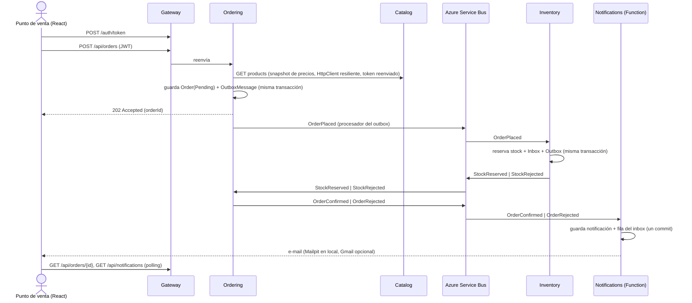

# microservices-demo

Una plataforma B2B de pedidos de cerveza, inspirada en el modelo BEES, construida como un sistema de
**microservicios en .NET 10** pequeño, pero pensado para producción. Un punto de venta (un bar o un almacén) inicia
sesión, recorre el catálogo y hace un pedido; el stock se reserva en otro servicio, el pedido se confirma o se rechaza,
y el resultado se registra, se muestra en un panel de notificaciones y se envía por e-mail.

El alcance es un MVP construido en unos dos días. Es lo bastante pequeño para explicarlo en diez minutos y se ejecuta
con un único comando, pero tiene todo lo que un sistema real necesita para ser confiable: transactional outbox,
consumidores idempotentes, dead-lettering, pipelines de resiliencia, validación de tokens en cada servicio, tests
contra una base de datos real y CI.

> Los datos del catálogo son ficticios (p. ej. *Golden Lager 350ml*, *Amber Ale 600ml*), con un guiño a una cerveza
> famosa de dibujos animados: *Duff-Style Classic Lager*.

Read in English: [README.md](README.md). Leia em português: [README_pt.md](README_pt.md). La documentación detallada
(`docs/`) está en inglés, salvo la [guía de entrevista](docs/faq_es.md), escrita en español.

## Contenido

- [Arquitectura](#arquitectura)
- [El flujo del pedido](#el-flujo-del-pedido)
- [Cómo ejecutarlo](#cómo-ejecutarlo)
- [Guion de la demo](#guion-de-la-demo)
- [Patrones de diseño — dónde y por qué](#patrones-de-diseño--dónde-y-por-qué)
- [Tests](#tests)
- [CI](#ci)
- [Estructura del repositorio](#estructura-del-repositorio)
- [Documentación](#documentación)
- [Próximos pasos](#próximos-pasos)

## Arquitectura

```
React (Vite) ──► Gateway (YARP + JWT) ──┬─► Catalog API    ── PostgreSQL (catalogdb)
                                        ├─► Ordering API   ── PostgreSQL (orderingdb)
                                        ├─► Inventory API  ── PostgreSQL (inventorydb)
                                        └─► Notifications  ── PostgreSQL (notificationsdb)
                                              (Azure Function)

Azure Service Bus (emulador)
  tópico order-events      ─ sub: inventory      (Subject = OrderPlaced)
                           ─ sub: notifications  (Subject = OrderConfirmed | OrderRejected)
  tópico inventory-events  ─ sub: ordering       (Subject = StockReserved | StockRejected)
```

| Servicio | Estilo | Responsabilidades | Endpoints |
|---|---|---|---|
| **Gateway** | Host mínimo + YARP | Punto de entrada único: proxy inverso, emisión de tokens de demo, validación de JWT, CORS, rate limiting | `POST /auth/token`, hace proxy de `/api/*` |
| **Catalog** | Vertical Slice | Productos (SKU, nombre, estilo, volumen, tamaño del pack, precio) | `GET /api/products`, `GET /api/products/{id}`, `POST`/`PUT /api/products` (Admin) |
| **Ordering** | Clean Architecture + DDD | Ciclo de vida del pedido, descuentos por volumen, publica y consume eventos | `POST /api/orders`, `GET /api/orders`, `GET /api/orders/{id}` |
| **Inventory** | Capa de servicio | Stock por SKU, reserva todo-o-nada | `GET /api/stock`, `PUT /api/stock/{sku}` (Admin) |
| **Notifications** | Azure Function (isolated worker) | Registra el resultado de los pedidos, envía el e-mail, sirve el panel | `GET /api/notifications` |
| **Web** | React + Vite + TypeScript | Login, catálogo, carrito, pedidos con estado en vivo, panel de notificaciones | — |

Reglas básicas que sigue el código (y que [`CLAUDE.md`](CLAUDE.md) deja por escrito):

- **Una base de datos por servicio.** Un servicio nunca lee la base de otro; el SKU es la única identidad que cruza
  una frontera.
- **Integración asíncrona.** Los servicios se comunican mediante eventos de integración en Azure Service Bus
  ([`BuildingBlocks.Contracts`](src/BuildingBlocks/BuildingBlocks.Contracts)), siempre publicados **a través del
  transactional outbox**, y todo consumidor es **idempotente** (tabla inbox indexada por `MessageId`). La única
  llamada síncrona —Ordering pidiéndole precios a Catalog— pasa por un pipeline Polly explícito.
- **Zero trust.** Solo el Gateway emite tokens, pero **cada servicio los valida por su cuenta**, y los endpoints están
  autenticados por defecto. Estar dentro de la red no es una credencial.
- **Las fallas esperadas son valores.** El código de aplicación devuelve `Result`/`Result<T>`; todas las APIs
  responden los errores como `ProblemDetails` (RFC 9457) con `code` y `traceId`.

Eventos de integración:

| Evento | Publicado por | Consumido por | Contenido |
|---|---|---|---|
| `OrderPlaced` | Ordering | Inventory | orderId, customerId, ítems (sku, cantidad) |
| `StockReserved` | Inventory | Ordering | orderId |
| `StockRejected` | Inventory | Ordering | orderId, motivo, SKUs faltantes |
| `OrderConfirmed` | Ordering | Notifications | orderId, customerId, customerEmail, total |
| `OrderRejected` | Ordering | Notifications | orderId, customerId, customerEmail, motivo |

Todo mensaje lleva `MessageId` (idempotencia), `CorrelationId` (= orderId) y `Subject` (= nombre del evento, que usan
los filtros de las suscripciones). Los tópicos y las suscripciones se declaran una sola vez en
[`Topology.cs`](src/BuildingBlocks/BuildingBlocks.Contracts/Topology.cs) y el AppHost aprovisiona el emulador a
partir de ahí, así que el código y el broker no pueden discrepar sobre los nombres.

## El flujo del pedido

El flujo es una **saga por coreografía**: nadie la orquesta, cada servicio reacciona al evento anterior, y un rechazo
es un resultado normal, no un error ([ADR 0003](docs/adr/0003-choreography-over-orchestration.md)).



Qué lo hace confiable:

1. **Outbox.** El pedido y su mensaje `OrderPlaced` se escriben en la misma transacción de base de datos
   ([`DomainEventsToOutboxInterceptor`](src/Services/Ordering/Ordering.Infrastructure/Outbox/DomainEventsToOutboxInterceptor.cs)).
   Un [`OutboxProcessor`](src/BuildingBlocks/BuildingBlocks.Messaging/Outbox/OutboxProcessor.cs) en segundo plano
   publica las filas pendientes con `FOR UPDATE SKIP LOCKED`, así que varias réplicas pueden ejecutarlo sin publicar
   una fila dos veces. No existe "guardado pero nunca publicado" ni "publicado pero revertido".
2. **Inbox.** La entrega es at-least-once, así que el
   [`ServiceBusSubscriptionProcessor`](src/BuildingBlocks/BuildingBlocks.Messaging/Consumers/ServiceBusSubscriptionProcessor.cs)
   consulta el inbox, ejecuta el handler y hace commit de **cambio de negocio + fila saliente del outbox + fila del
   inbox** juntos. Un mensaje reentregado se completa sin hacer nada dos veces.
3. **Dead-letter queue.** Un handler que lanza una excepción abandona el mensaje; tras 5 entregas el broker lo manda a
   la dead-letter, así que un mensaje envenenado nunca bloquea la suscripción.
4. **Concurrencia optimista.** Las filas de stock usan el `xmin` de PostgreSQL como token de concurrencia: dos
   reservas que compiten por el mismo SKU no pueden ganar ambas; la perdedora se reintenta con las cantidades
   actuales.
5. **El e-mail se envía después del commit.** La notificación es la fuente de verdad; una falla de SMTP queda
   registrada en ella (`EmailStatus`), nunca se relanza.

## Cómo ejecutarlo

### Requisitos previos

- .NET SDK 10 (fijado en [`global.json`](global.json))
- Docker Desktop en ejecución, con **≥ 6 GB de RAM** (el emulador de Service Bus necesita un contenedor de SQL Server)
- Node.js 22+
- Azure Functions Core Tools v4 (`npm i -g azure-functions-core-tools@4`) — solo para el camino con Aspire

### Opción A — .NET Aspire (desarrollo)

```bash
dotnet run --project src/AppHost
```

El AppHost levanta PostgreSQL (cuatro bases), el emulador de Service Bus con sus tópicos y suscripciones filtradas,
Mailpit, Azurite (storage para el host de Functions), los cinco proyectos de backend y el servidor de desarrollo de
React. La URL del **dashboard de Aspire** (recursos, logs, trazas, métricas) aparece en la consola.

No hace falta configurar ningún secreto: la clave de firma del JWT y las contraseñas de la infraestructura se generan
en la primera ejecución y se guardan en los user-secrets del AppHost.

| Qué | Dónde |
|---|---|
| App web | http://localhost:5173 |
| Gateway | http://localhost:5100 |
| Catalog / Ordering / Inventory / Notifications | http://localhost:5101 / 5102 / 5103 / 5104 |
| Referencia de la API (Scalar, solo en Development) | `/scalar` en el Gateway, Catalog, Ordering e Inventory |
| Mailpit (e-mails capturados) | http://localhost:8025 |

### Opción B — docker-compose (contenedores)

```bash
cp .env.example .env
```

Completa los tres valores marcados como `REQUIRED` en `.env` (`POSTGRES_PASSWORD`, `SERVICEBUS_SQL_PASSWORD`,
`JWT_SIGNING_KEY`) y luego:

```bash
docker compose up --build
```

| Qué | Dónde |
|---|---|
| App web (nginx) | http://localhost:4173 |
| Gateway | http://localhost:5100 |
| Servicios | http://localhost:5101 – 5104 |
| Dashboard de Aspire (standalone, OTLP) | http://localhost:18888 |
| Mailpit | http://localhost:8025 |

Las dos opciones publican los mismos puertos; ejecuta una u otra, no ambas.

### Cuentas de demo

Credenciales de demo, **no secretos**: están en el `appsettings.json` del Gateway para que el repositorio funcione
para cualquiera que lo clone. La contraseña es `demo` para todas.

| Usuario | Rol | Puede |
|---|---|---|
| `bar`, `market` | `PointOfSale` | Leer el catálogo y el stock, hacer y consultar **sus propios** pedidos y notificaciones |
| `admin` | `Admin` | Todo lo anterior, más `POST`/`PUT /api/products` y `PUT /api/stock/{sku}` |

### E-mail real (opcional)

Por defecto todo e-mail queda capturado en Mailpit. Para entregarlo por Gmail, configura `Email:Host=smtp.gmail.com`,
`Email:Port=587`, `Email:UseStartTls=true` y una **contraseña de aplicación** de Gmail, y apunta
`DemoUsers:bar:Email` a una casilla real. El [`.env.example`](.env.example) muestra las variables exactas;
`Email:Enabled=false` cambia al remitente Null Object (la notificación se sigue guardando, no se envía nada).

### Postman

Una colección por servicio, con scripts de test para los caminos felices y de error, en [`docs/postman`](docs/postman).
También sirven como smoke test:

```bash
npx newman run docs/postman/inventory.postman_collection.json -e docs/postman/local.postman_environment.json
```

## Guion de la demo

Unos 5–10 minutos.

1. **Recorrido por el repositorio.** Estructura, [`docs/job-requirements.md`](docs/job-requirements.md), la tabla de
   patrones de más abajo.
2. **Levantarlo.** `dotnet run --project src/AppHost` → dashboard de Aspire: PostgreSQL, el emulador de Service Bus,
   un recurso por servicio.
3. **Camino feliz.** Abre http://localhost:5173, inicia sesión como `bar` / `demo`, agrega algunos productos al
   carrito y haz el pedido. La página del pedido muestra `Pending` y pasa sola a `Confirmed` en pocos segundos; la
   notificación aparece en el panel y el e-mail en Mailpit (http://localhost:8025).
4. **Camino de compensación.** Pide 50 packs de *Midnight Stout 500ml* (solo hay 5 en stock). El pedido vuelve
   `Rejected` con el motivo y el SKU, no se reserva nada para las otras líneas (todo-o-nada), y el descuento por
   volumen del 10 % muestra que los totales los decide el servidor, no el carrito.
5. **Aislamiento.** Inicia sesión como `market`: la lista de pedidos y el panel de notificaciones están vacíos — la
   identidad viene del token, y el pedido de otro punto de venta responde 404.
6. **Traza distribuida.** En el dashboard, abre la traza del pedido: Gateway → Ordering → Catalog → Service Bus →
   Inventory → Ordering → Notifications, unida por el `traceparent` que lleva cada mensaje.
7. **Recorrido por el código.** El agregado [`Order`](src/Services/Ordering/Ordering.Domain/Orders/Order.cs) y su
   máquina de estados, el [`OutboxProcessor`](src/BuildingBlocks/BuildingBlocks.Messaging/Outbox/OutboxProcessor.cs),
   el [pipeline del consumidor idempotente](src/BuildingBlocks/BuildingBlocks.Messaging/Consumers/ServiceBusSubscriptionProcessor.cs),
   la strategy [`VolumeDiscountPolicy`](src/Services/Ordering/Ordering.Domain/Discounts/VolumeDiscountPolicy.cs) y el
   [pipeline Polly del cliente de Catalog](src/Services/Ordering/Ordering.Infrastructure/Catalog/CatalogClientRegistration.cs).
8. **Tests y CI.** `dotnet test microservices-demo.slnx` y el workflow de GitHub Actions.

Extras opcionales: detén el recurso Catalog en el dashboard y haz un pedido — la primera llamada reintenta durante
unos 9 s, luego el circuito se abre y las siguientes fallan rápido con un 503 `Catalog.Unavailable`; el Gateway
responde 429 después de 10 inicios de sesión en un minuto.

## Patrones de diseño — dónde y por qué

### Arquitectónicos

| Patrón | Dónde | Por qué |
|---|---|---|
| Microservicios + base de datos por servicio | Catalog, Ordering, Inventory, Notifications | Despliegue independiente y propiedad de los datos |
| API Gateway | [`src/Gateway`](src/Gateway) | Punto de entrada único; autenticación, CORS y rate limiting en un solo lugar ([ADR 0004](docs/adr/0004-yarp-as-api-gateway.md)) |
| Clean Architecture | [`src/Services/Ordering`](src/Services/Ordering) | El dominio más rico; las dependencias apuntan hacia adentro, garantizado por tests de arquitectura ([ADR 0002](docs/adr/0002-architecture-style-per-service.md)) |
| Vertical Slice Architecture | [`src/Services/Catalog`](src/Services/Catalog) | Servicio tipo CRUD: una carpeta por funcionalidad, menos ceremonia |
| Capa de servicio (controller → interfaz de servicio → implementación) | [`src/Services/Inventory`](src/Services/Inventory): `StockController` → `IStockService` → `StockService` | El estilo más común en los servicios .NET existentes; aquí además le da a la API HTTP y al consumidor de `OrderPlaced` un único lugar dueño del stock ([ADR 0008](docs/adr/0008-service-layer-for-inventory.md)) |
| Minimal APIs y controllers MVC | Minimal APIs en Catalog y el Gateway, controllers en Ordering e Inventory | Los dos estilos de ASP.NET Core, con el mismo contrato de errores y validación ([ADR 0007](docs/adr/0007-controllers-for-inventory-and-ordering.md)) |
| CQRS (liviano) | Ordering | Las escrituras pasan por el agregado; las lecturas son proyecciones `AsNoTracking` que nunca lo cargan |
| Publish/Subscribe | Tópicos de Service Bus + suscripciones filtradas | Desacoplamiento temporal y espacial |
| Saga por coreografía + compensación | El flujo del pedido | Consistencia eventual sin transacciones distribuidas ([ADR 0003](docs/adr/0003-choreography-over-orchestration.md)) |
| Transactional Outbox | [`BuildingBlocks.Messaging/Outbox`](src/BuildingBlocks/BuildingBlocks.Messaging/Outbox), usado por Ordering e Inventory | "Guardar estado + publicar evento" de forma atómica ([ADR 0001](docs/adr/0001-azure-service-bus-without-messaging-framework.md)) |
| Consumidor idempotente (Inbox) | Inventory, Ordering, Notifications | Service Bus entrega at-least-once |
| Dead-Letter Queue | Todas las suscripciones (máximo de 5 entregas) | Los mensajes envenenados no bloquean el procesamiento |
| Retry + Circuit Breaker + Timeout (Polly v8) | `HttpClient` Ordering → Catalog | Tolerar fallas transitorias; fallar rápido cuando Catalog está caído |
| Autenticación por token, validada en todas partes | El Gateway emite, cada servicio valida | El Gateway es una comodidad, no la frontera de seguridad |
| Reenvío de token (on-behalf-of) | Ordering → Catalog (`AccessTokenPropagationHandler`) | La llamada downstream lleva la identidad de quien llama |
| Rate limiting | Gateway, ventana fija por llamador | Un cliente ruidoso no puede gastar el cupo de todos los demás |
| Health checks | `/health`, `/alive` en todos los servicios (ServiceDefaults) | Operabilidad |
| Polling en el cliente | Web (`usePolledResource`) | Hacer un pedido responde 202; el resultado llega después por el bus |

### Domain-Driven Design (Ordering)

| Patrón | Dónde |
|---|---|
| Aggregate Root | [`Order`](src/Services/Ordering/Ordering.Domain/Orders/Order.cs) (dueño de sus `OrderItem`s) |
| Value Objects | [`Money`, `Sku`, `Quantity`](src/Services/Ordering/Ordering.Domain/ValueObjects) — constructores privados, `Create(...) → Result<T>` |
| Domain Events | `OrderPlaced/Confirmed/RejectedDomainEvent`, traducidos a filas del outbox al guardar (se reutiliza el `EventId` del dominio, así que un guardado reintentado no puede generar un segundo mensaje) |
| Factory Method | `Order.Place(...)` garantiza las invariantes en la creación |
| Máquina de estados (transiciones protegidas) | `Pending → Confirmed | Rejected`; una transición inválida es un error `Conflict` |
| Guard clauses | Los errores de programación lanzan excepción; las reglas de negocio devuelven errores `Result` |

### Diseño (GoF y otros)

| Patrón | Dónde |
|---|---|
| Repository + Unit of Work | `IOrderRepository`, `OrderingDbContext` como unit of work (Catalog/Inventory usan el `DbContext` directamente) |
| Strategy | [`IDiscountPolicy`](src/Services/Ordering/Ordering.Domain/Discounts): `VolumeDiscountPolicy`, `NoDiscountPolicy` |
| Decorator | [`LoggingDecorator` → `ValidationDecorator`](src/Services/Ordering/Ordering.Application/Decorators) → handler, escritos a mano, sin MediatR |
| Adapter | `IEventBus` → `AzureServiceBusEventBus`; `IEmailSender` → `SmtpEmailSender` (MailKit) |
| Null Object | `NoOpEmailSender` (`Email:Enabled=false`), `NoDiscountPolicy` |
| Result pattern | [`Result` / `Error`](src/BuildingBlocks/BuildingBlocks.Common/Results) mapeados a `ProblemDetails` (RFC 9457) |
| Mapeo de objetos | Mapperly en Ordering e Inventory (generado en tiempo de compilación, verificado por el compilador, `ProjectToResponse()` → SQL); Catalog y Notifications mapean a mano a propósito ([ADR 0006](docs/adr/0006-object-mapping-mapperly.md), que reemplaza a la [0005](docs/adr/0005-object-mapping-mapster-and-manual.md)) |
| Options pattern | `PricingOptions`, `CatalogClientOptions`, `OutboxOptions`, `JwtOptions`, `EmailOptions` (validadas al iniciar) |
| Test Data Builder | [`OrderBuilder`](tests/Ordering.Domain.UnitTests/Builders/OrderBuilder.cs) |

## Tests

```bash
dotnet test microservices-demo.slnx
```

| Nivel | Proyecto | Qué |
|---|---|---|
| Unitario | `Ordering.Domain.UnitTests` | Invariantes del agregado, transiciones de estado, estrategias de descuento, value objects |
| Unitario | `Ordering.Application.UnitTests` | Handler de hacer pedido (snapshot de Catalog, SKU desconocido, Catalog caído), decorator de validación, valores de los mappers (en memoria y proyección) |
| Unitario | `Inventory.UnitTests` | Reglas de reserva todo-o-nada, valores de los mappers, `StockController` con `IStockService` mockeado (NSubstitute) |
| Unitario | `Notifications.UnitTests` | Texto de la notificación, transiciones del estado del e-mail, Null Object vs remitente SMTP según la configuración |
| Integración | `Ordering.IntegrationTests` | API + EF Core contra **PostgreSQL real** (Testcontainers): pedido y fila del outbox escritos de forma atómica, los resultados de stock confirman o rechazan el pedido (uno tardío se ignora, uno de un pedido desconocido se reintenta), lecturas por cliente, validación de tokens |
| Integración | `Inventory.IntegrationTests` | API + EF Core contra **PostgreSQL real** (Testcontainers), escritos antes del refactor a la capa de servicio para fijar su contrato: lista de stock con y sin `?sku=`, 400 con más de 100 SKUs, `PUT` 200 / 400 / 404 / 401 / 403, y el consumidor de `OrderPlaced` reservando todo-o-nada y registrando `StockReserved` / `StockRejected` en el outbox |
| Funcional | `Gateway.Tests` | El Gateway real en memoria: emisión de tokens, 401 antes del proxy, 403 para el rol incorrecto, preflight de CORS |
| Arquitectura | `Architecture.Tests` | Las capas de Ordering solo dependen hacia adentro (NetArchTest) |

xUnit v3, Shouldly, NSubstitute; los tests se nombran `Method_State_ExpectedResult`. Los tests de integración
necesitan Docker en ejecución. La base de datos nunca se mockea: un fake coincide con lo que el test espera,
PostgreSQL no. Frontend: `npm --prefix src/Web run lint` y `npm --prefix src/Web run build`.

## CI

[`.github/workflows/ci.yml`](.github/workflows/ci.yml) se ejecuta en cada push y pull request a `main`:

1. **backend** — .NET SDK de `global.json`, build Release con warnings como errores (incluido el estilo de código),
   tests unitarios, de arquitectura y del Gateway, luego los tests de integración con Testcontainers (Ordering e
   Inventory); se publican los resultados `.trx`.
2. **frontend** — `npm ci`, lint, build.
3. **docker** — depende de los dos anteriores; construye las seis imágenes con Buildx y la caché de GitHub Actions
   (sin push).

## Estructura del repositorio

```
src/
├─ AppHost/                 Orquestación .NET Aspire (el entorno local con un único comando)
├─ ServiceDefaults/         OpenTelemetry, health checks, resiliencia, service discovery
├─ BuildingBlocks/
│  ├─ BuildingBlocks.Common/     Result, Error
│  ├─ BuildingBlocks.Contracts/  Eventos de integración + topología de Service Bus
│  ├─ BuildingBlocks.Messaging/  IEventBus, adapter de Service Bus, outbox, inbox, pipeline del consumidor
│  └─ BuildingBlocks.Web/        ProblemDetails, filtros de validación, descubrimiento de endpoints, configuración MVC, validación de JWT
├─ Gateway/                 YARP + emisión de tokens
├─ Services/
│  ├─ Catalog/Catalog.Api/              Vertical Slice
│  ├─ Ordering/Ordering.Domain | .Application | .Infrastructure | .Api   Clean Architecture
│  └─ Inventory/Inventory.Api/          Capa de servicio (controller → IStockService)
├─ Functions/Notifications/ Azure Function (isolated worker)
└─ Web/                     React + Vite + TypeScript
tests/                      Tests unitarios, de integración, funcionales y de arquitectura
docs/                       Plan, ADRs, mapa de requisitos, flujo con IA, colecciones Postman
docker/                     Script de init de PostgreSQL y config del emulador de Service Bus para docker-compose
tools/                      Script de smoke test del emulador de Service Bus
```

Higiene de build: SDK fijado en `global.json`; nullable, warnings como errores y estilo de código verificados en el
build (`Directory.Build.props`, `.editorconfig`); versiones de NuGet solo en `Directory.Packages.props` (Central
Package Management).

## Documentación

| Documento | Qué |
|---|---|
| [docs/implementation-plan.md](docs/implementation-plan.md) | Alcance, fases y las notas que cada fase dejó para la siguiente |
| [docs/job-requirements.md](docs/job-requirements.md) | Cada requisito del puesto mapeado al código que lo demuestra |
| [docs/adr](docs/adr) | Architecture Decision Records |
| [docs/ai-workflow.md](docs/ai-workflow.md) | Cómo se construyó el proyecto con un asistente de IA y qué quedó en manos del humano |
| [docs/faq_es.md](docs/faq_es.md) | Guía de entrevista en español: preguntas y respuestas por nivel (de cero programación a arquitecto), con el código de cada respuesta |
| [docs/postman](docs/postman) | Colecciones Postman y cómo ejecutarlas |
| [CLAUDE.md](CLAUDE.md) | Las convenciones y reglas de arquitectura, escritas para asistentes de IA (y para humanos) |

## Próximos pasos

Dejados fuera del MVP a propósito:

- Liberar el stock reservado ante `OrderRejected`/cancelación y consolidarlo en el envío (una tabla de reservas).
- Enviar el estado del pedido al navegador (SSE o SignalR) en lugar de hacer polling.
- Un proveedor de identidad real (Entra ID, Keycloak) y client credentials para llamadas entre máquinas; los servicios
  ya solo *validan* tokens, así que solo se iría la mitad emisora del Gateway.
- Una saga orquestada (Durable Functions o un process manager) si el flujo crece más allá de tres pasos con timeouts.
- Kubernetes/Helm con KEDA escalando según el largo de la suscripción, Azure API Management por delante, Bicep para
  los recursos de Azure.
- Quality gates de SonarQube, exporter de OpenTelemetry a Datadog (o Azure Monitor), tests de frontend.
