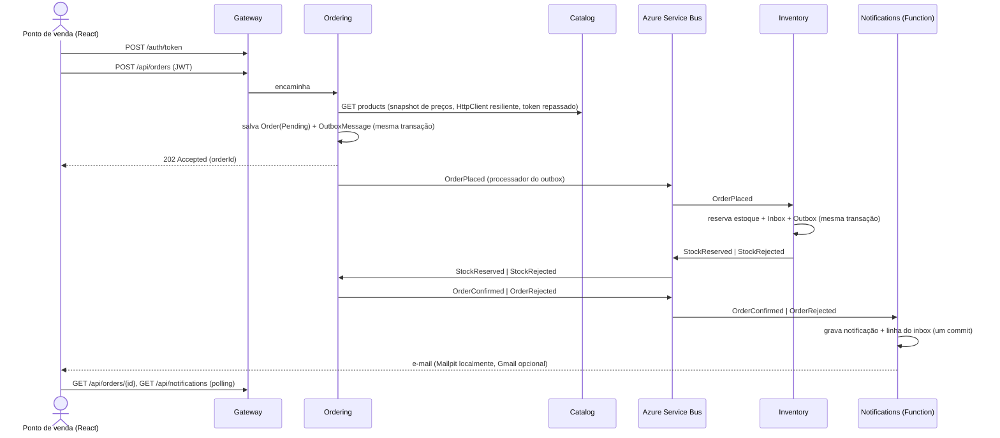

# microservices-demo

Uma plataforma B2B de pedidos de cerveja, inspirada no modelo BEES, construída como um sistema de
**microsserviços em .NET 10** pequeno, mas pensado para produção. Um ponto de venda (um bar ou um mercado) faz login,
navega pelo catálogo e faz um pedido; o estoque é reservado em outro serviço, o pedido é confirmado ou rejeitado, e o
resultado é registrado, exibido em um painel de notificações e enviado por e-mail.

O escopo é um MVP construído em cerca de dois dias. É pequeno o bastante para ser explicado em dez minutos e roda com
um único comando, mas tem tudo o que um sistema real precisa para ser confiável: transactional outbox, consumidores
idempotentes, dead-lettering, pipelines de resiliência, validação de token em todos os serviços, testes contra um
banco de dados real e CI.

> Os dados do catálogo são fictícios (ex.: *Golden Lager 350ml*, *Amber Ale 600ml*), com uma homenagem a uma cerveja
> famosa de desenho animado: *Duff-Style Classic Lager*.

Read in English: [README.md](README.md). A documentação detalhada (`docs/`) está em inglês.

## Conteúdo

- [Arquitetura](#arquitetura)
- [O fluxo do pedido](#o-fluxo-do-pedido)
- [Como executar](#como-executar)
- [Roteiro da demo](#roteiro-da-demo)
- [Padrões de projeto — onde e por quê](#padrões-de-projeto--onde-e-por-quê)
- [Testes](#testes)
- [CI](#ci)
- [Estrutura do repositório](#estrutura-do-repositório)
- [Documentação](#documentação)
- [Próximos passos](#próximos-passos)

## Arquitetura

```
React (Vite) ──► Gateway (YARP + JWT) ──┬─► Catalog API    ── PostgreSQL (catalogdb)
                                        ├─► Ordering API   ── PostgreSQL (orderingdb)
                                        ├─► Inventory API  ── PostgreSQL (inventorydb)
                                        └─► Notifications  ── PostgreSQL (notificationsdb)
                                              (Azure Function)

Azure Service Bus (emulador)
  tópico order-events      ─ sub: inventory      (Subject = OrderPlaced)
                           ─ sub: notifications  (Subject = OrderConfirmed | OrderRejected)
  tópico inventory-events  ─ sub: ordering       (Subject = StockReserved | StockRejected)
```

| Serviço | Estilo | Responsabilidades | Endpoints |
|---|---|---|---|
| **Gateway** | Host mínimo + YARP | Ponto de entrada único: proxy reverso, emissão de tokens de demo, validação de JWT, CORS, rate limiting | `POST /auth/token`, faz proxy de `/api/*` |
| **Catalog** | Vertical Slice | Produtos (SKU, nome, estilo, volume, tamanho do pack, preço) | `GET /api/products`, `GET /api/products/{id}`, `POST`/`PUT /api/products` (Admin) |
| **Ordering** | Clean Architecture + DDD | Ciclo de vida do pedido, descontos por volume, publica e consome eventos | `POST /api/orders`, `GET /api/orders`, `GET /api/orders/{id}` |
| **Inventory** | Camada de serviço | Estoque por SKU, reserva tudo-ou-nada | `GET /api/stock`, `PUT /api/stock/{sku}` (Admin) |
| **Notifications** | Azure Function (isolated worker) | Registra o resultado dos pedidos, envia o e-mail, serve o painel | `GET /api/notifications` |
| **Web** | React + Vite + TypeScript | Login, catálogo, carrinho, pedidos com status ao vivo, painel de notificações | — |

Regras básicas que o código segue (e que o [`CLAUDE.md`](CLAUDE.md) registra):

- **Um banco de dados por serviço.** Um serviço nunca lê o banco de outro; o SKU é a única identidade que cruza uma
  fronteira.
- **Integração assíncrona.** Os serviços conversam por eventos de integração no Azure Service Bus
  ([`BuildingBlocks.Contracts`](src/BuildingBlocks/BuildingBlocks.Contracts)), sempre publicados **pelo transactional
  outbox**, e todo consumidor é **idempotente** (tabela inbox indexada por `MessageId`). A única chamada síncrona —
  o Ordering pedindo preços ao Catalog — passa por um pipeline Polly explícito.
- **Zero trust.** Só o Gateway emite tokens, mas **cada serviço os valida por conta própria**, e os endpoints são
  autenticados por padrão. Estar dentro da rede não é uma credencial.
- **Falhas esperadas são valores.** O código de aplicação retorna `Result`/`Result<T>`; todas as APIs respondem
  erros como `ProblemDetails` (RFC 9457) com `code` e `traceId`.

Eventos de integração:

| Evento | Publicado por | Consumido por | Conteúdo |
|---|---|---|---|
| `OrderPlaced` | Ordering | Inventory | orderId, customerId, itens (sku, quantidade) |
| `StockReserved` | Inventory | Ordering | orderId |
| `StockRejected` | Inventory | Ordering | orderId, motivo, SKUs faltantes |
| `OrderConfirmed` | Ordering | Notifications | orderId, customerId, customerEmail, total |
| `OrderRejected` | Ordering | Notifications | orderId, customerId, customerEmail, motivo |

Toda mensagem carrega `MessageId` (idempotência), `CorrelationId` (= orderId) e `Subject` (= nome do evento, usado
nos filtros das assinaturas). Tópicos e assinaturas são declarados uma única vez em
[`Topology.cs`](src/BuildingBlocks/BuildingBlocks.Contracts/Topology.cs) e o AppHost provisiona o emulador a partir
dele, então o código e o broker não podem divergir sobre os nomes.

## O fluxo do pedido

O fluxo é uma **saga por coreografia**: ninguém o orquestra, cada serviço reage ao evento anterior, e uma rejeição é
um resultado normal, não um erro ([ADR 0003](docs/adr/0003-choreography-over-orchestration.md)).



O que o torna confiável:

1. **Outbox.** O pedido e sua mensagem `OrderPlaced` são gravados na mesma transação do banco
   ([`DomainEventsToOutboxInterceptor`](src/Services/Ordering/Ordering.Infrastructure/Outbox/DomainEventsToOutboxInterceptor.cs)).
   Um [`OutboxProcessor`](src/BuildingBlocks/BuildingBlocks.Messaging/Outbox/OutboxProcessor.cs) em segundo plano
   publica as linhas pendentes com `FOR UPDATE SKIP LOCKED`, então várias réplicas podem executá-lo sem publicar uma
   linha duas vezes. Não existe "salvo mas nunca publicado" nem "publicado mas desfeito".
2. **Inbox.** A entrega é at-least-once, então o
   [`ServiceBusSubscriptionProcessor`](src/BuildingBlocks/BuildingBlocks.Messaging/Consumers/ServiceBusSubscriptionProcessor.cs)
   consulta o inbox, executa o handler e faz commit de **mudança de negócio + linha de saída no outbox + linha do
   inbox** juntos. Uma mensagem reentregue é concluída sem fazer nada duas vezes.
3. **Dead-letter queue.** Um handler que lança exceção abandona a mensagem; após 5 entregas o broker a envia para a
   dead-letter, então uma mensagem envenenada nunca bloqueia a assinatura.
4. **Concorrência otimista.** As linhas de estoque usam o `xmin` do PostgreSQL como token de concorrência: duas
   reservas disputando o mesmo SKU não podem vencer as duas; a perdedora é reprocessada com as quantidades atuais.
5. **O e-mail é enviado depois do commit.** A notificação é a fonte da verdade; uma falha de SMTP é registrada nela
   (`EmailStatus`), nunca relançada.

## Como executar

### Pré-requisitos

- .NET SDK 10 (fixado em [`global.json`](global.json))
- Docker Desktop em execução, com **≥ 6 GB de RAM** (o emulador do Service Bus precisa de um contêiner SQL Server)
- Node.js 22+
- Azure Functions Core Tools v4 (`npm i -g azure-functions-core-tools@4`) — só para o caminho com Aspire

### Opção A — .NET Aspire (desenvolvimento)

```bash
dotnet run --project src/AppHost
```

O AppHost sobe o PostgreSQL (quatro bancos), o emulador do Service Bus com seus tópicos e assinaturas filtradas, o
Mailpit, o Azurite (storage para o host de Functions), os cinco projetos de backend e o servidor de desenvolvimento
React. A URL do **dashboard do Aspire** (recursos, logs, traces, métricas) aparece no console.

Nenhum segredo precisa ser configurado: a chave de assinatura do JWT e as senhas da infraestrutura são geradas na
primeira execução e guardadas nos user-secrets do AppHost.

| O quê | Onde |
|---|---|
| App web | http://localhost:5173 |
| Gateway | http://localhost:5100 |
| Catalog / Ordering / Inventory / Notifications | http://localhost:5101 / 5102 / 5103 / 5104 |
| Referência da API (Scalar, só em Development) | `/scalar` no Gateway, Catalog, Ordering e Inventory |
| Mailpit (e-mails capturados) | http://localhost:8025 |

### Opção B — docker-compose (contêineres)

```bash
cp .env.example .env
```

Preencha os três valores marcados como `REQUIRED` no `.env` (`POSTGRES_PASSWORD`, `SERVICEBUS_SQL_PASSWORD`,
`JWT_SIGNING_KEY`) e depois:

```bash
docker compose up --build
```

| O quê | Onde |
|---|---|
| App web (nginx) | http://localhost:4173 |
| Gateway | http://localhost:5100 |
| Serviços | http://localhost:5101 – 5104 |
| Dashboard do Aspire (standalone, OTLP) | http://localhost:18888 |
| Mailpit | http://localhost:8025 |

As duas opções publicam as mesmas portas; execute uma ou outra, não as duas.

### Contas de demonstração

Credenciais de demo, **não segredos** — estão no `appsettings.json` do Gateway para que o repositório funcione para
qualquer pessoa que o clone. A senha é `demo` para todas.

| Usuário | Papel | Pode |
|---|---|---|
| `bar`, `market` | `PointOfSale` | Ler catálogo e estoque, fazer e consultar **os próprios** pedidos e notificações |
| `admin` | `Admin` | Tudo acima, mais `POST`/`PUT /api/products` e `PUT /api/stock/{sku}` |

### E-mail real (opcional)

Por padrão todo e-mail é capturado pelo Mailpit. Para entregar pelo Gmail, configure `Email:Host=smtp.gmail.com`,
`Email:Port=587`, `Email:UseStartTls=true` e uma **senha de app** do Gmail, e aponte `DemoUsers:bar:Email` para uma
caixa real. O [`.env.example`](.env.example) mostra as variáveis exatas; `Email:Enabled=false` troca para o remetente
Null Object (a notificação continua sendo gravada, nada é enviado).

### Postman

Uma coleção por serviço, com scripts de teste para os caminhos de sucesso e de erro, em [`docs/postman`](docs/postman).
Servem também como smoke test:

```bash
npx newman run docs/postman/inventory.postman_collection.json -e docs/postman/local.postman_environment.json
```

## Roteiro da demo

Cerca de 5–10 minutos.

1. **Tour pelo repositório.** Estrutura, [`docs/job-requirements.md`](docs/job-requirements.md), a tabela de padrões
   abaixo.
2. **Subir tudo.** `dotnet run --project src/AppHost` → dashboard do Aspire: PostgreSQL, emulador do Service Bus, um
   recurso por serviço.
3. **Caminho feliz.** Abra http://localhost:5173, entre como `bar` / `demo`, adicione alguns produtos ao carrinho e
   faça o pedido. A página do pedido mostra `Pending` e muda sozinha para `Confirmed` em poucos segundos; a
   notificação aparece no painel e o e-mail no Mailpit (http://localhost:8025).
4. **Caminho de compensação.** Peça 50 packs de *Midnight Stout 500ml* (só há 5 em estoque). O pedido volta
   `Rejected` com o motivo e o SKU, nada é reservado para as outras linhas (tudo-ou-nada), e o desconto por volume de
   10 % mostra que os totais são decididos pelo servidor, não pelo carrinho.
5. **Isolamento.** Entre como `market`: a lista de pedidos e o painel de notificações estão vazios — a identidade vem
   do token, e o pedido de outro ponto de venda responde 404.
6. **Trace distribuído.** No dashboard, abra o trace do pedido: Gateway → Ordering → Catalog → Service Bus →
   Inventory → Ordering → Notifications, costurado pelo `traceparent` que cada mensagem carrega.
7. **Passeio pelo código.** O agregado [`Order`](src/Services/Ordering/Ordering.Domain/Orders/Order.cs) e sua máquina
   de estados, o [`OutboxProcessor`](src/BuildingBlocks/BuildingBlocks.Messaging/Outbox/OutboxProcessor.cs), o
   [pipeline do consumidor idempotente](src/BuildingBlocks/BuildingBlocks.Messaging/Consumers/ServiceBusSubscriptionProcessor.cs),
   a strategy [`VolumeDiscountPolicy`](src/Services/Ordering/Ordering.Domain/Discounts/VolumeDiscountPolicy.cs) e o
   [pipeline Polly do cliente do Catalog](src/Services/Ordering/Ordering.Infrastructure/Catalog/CatalogClientRegistration.cs).
8. **Testes e CI.** `dotnet test microservices-demo.slnx` e o workflow do GitHub Actions.

Extras opcionais: pare o recurso Catalog no dashboard e faça um pedido — a primeira chamada tenta por cerca de 9 s,
depois o circuito abre e as seguintes falham rápido com 503 `Catalog.Unavailable`; o Gateway responde 429 depois de
10 logins em um minuto.

## Padrões de projeto — onde e por quê

### Arquiteturais

| Padrão | Onde | Por quê |
|---|---|---|
| Microsserviços + banco por serviço | Catalog, Ordering, Inventory, Notifications | Deploy independente e posse dos dados |
| API Gateway | [`src/Gateway`](src/Gateway) | Ponto de entrada único; autenticação, CORS e rate limiting em um só lugar ([ADR 0004](docs/adr/0004-yarp-as-api-gateway.md)) |
| Clean Architecture | [`src/Services/Ordering`](src/Services/Ordering) | O domínio mais rico; dependências apontam para dentro, garantido por testes de arquitetura ([ADR 0002](docs/adr/0002-architecture-style-per-service.md)) |
| Vertical Slice Architecture | [`src/Services/Catalog`](src/Services/Catalog) | Serviço tipo CRUD: uma pasta por funcionalidade, menos cerimônia |
| Camada de serviço (controller → interface de serviço → implementação) | [`src/Services/Inventory`](src/Services/Inventory): `StockController` → `IStockService` → `StockService` | O estilo mais comum nos serviços .NET existentes; aqui também dá à API HTTP e ao consumidor de `OrderPlaced` um único lugar dono do estoque ([ADR 0008](docs/adr/0008-service-layer-for-inventory.md)) |
| Minimal APIs e controllers MVC | Minimal APIs no Catalog e no Gateway, controllers no Ordering e no Inventory | Os dois estilos do ASP.NET Core, com o mesmo contrato de erros e validação ([ADR 0007](docs/adr/0007-controllers-for-inventory-and-ordering.md)) |
| CQRS (leve) | Ordering | Escritas passam pelo agregado; leituras são projeções `AsNoTracking` que nunca o carregam |
| Publish/Subscribe | Tópicos do Service Bus + assinaturas filtradas | Desacoplamento temporal e espacial |
| Saga por coreografia + compensação | O fluxo do pedido | Consistência eventual sem transações distribuídas ([ADR 0003](docs/adr/0003-choreography-over-orchestration.md)) |
| Transactional Outbox | [`BuildingBlocks.Messaging/Outbox`](src/BuildingBlocks/BuildingBlocks.Messaging/Outbox), usado por Ordering e Inventory | "Salvar estado + publicar evento" de forma atômica ([ADR 0001](docs/adr/0001-azure-service-bus-without-messaging-framework.md)) |
| Consumidor idempotente (Inbox) | Inventory, Ordering, Notifications | O Service Bus entrega at-least-once |
| Dead-Letter Queue | Todas as assinaturas (máximo de 5 entregas) | Mensagens envenenadas não bloqueiam o processamento |
| Retry + Circuit Breaker + Timeout (Polly v8) | `HttpClient` Ordering → Catalog | Tolerar falhas transitórias; falhar rápido quando o Catalog está fora |
| Autenticação por token, validada em todo lugar | Gateway emite, cada serviço valida | O Gateway é uma conveniência, não a fronteira de segurança |
| Repasse de token (on-behalf-of) | Ordering → Catalog (`AccessTokenPropagationHandler`) | A chamada downstream leva a identidade de quem chamou |
| Rate limiting | Gateway, janela fixa por chamador | Um cliente barulhento não consome a cota de todos |
| Health checks | `/health`, `/alive` em todos os serviços (ServiceDefaults) | Operabilidade |
| Polling no cliente | Web (`usePolledResource`) | Fazer um pedido responde 202; o resultado chega depois pelo barramento |

### Domain-Driven Design (Ordering)

| Padrão | Onde |
|---|---|
| Aggregate Root | [`Order`](src/Services/Ordering/Ordering.Domain/Orders/Order.cs) (dono dos seus `OrderItem`s) |
| Value Objects | [`Money`, `Sku`, `Quantity`](src/Services/Ordering/Ordering.Domain/ValueObjects) — construtores privados, `Create(...) → Result<T>` |
| Domain Events | `OrderPlaced/Confirmed/RejectedDomainEvent`, traduzidos em linhas do outbox ao salvar (o `EventId` do domínio é reutilizado, então um save repetido não gera uma segunda mensagem) |
| Factory Method | `Order.Place(...)` garante as invariantes na criação |
| Máquina de estados (transições protegidas) | `Pending → Confirmed | Rejected`; uma transição inválida é um erro `Conflict` |
| Guard clauses | Erros de programação lançam exceção; regras de negócio retornam erros `Result` |

### Design (GoF e outros)

| Padrão | Onde |
|---|---|
| Repository + Unit of Work | `IOrderRepository`, `OrderingDbContext` como unit of work (Catalog/Inventory usam o `DbContext` diretamente) |
| Strategy | [`IDiscountPolicy`](src/Services/Ordering/Ordering.Domain/Discounts): `VolumeDiscountPolicy`, `NoDiscountPolicy` |
| Decorator | [`LoggingDecorator` → `ValidationDecorator`](src/Services/Ordering/Ordering.Application/Decorators) → handler, escritos à mão, sem MediatR |
| Adapter | `IEventBus` → `AzureServiceBusEventBus`; `IEmailSender` → `SmtpEmailSender` (MailKit) |
| Null Object | `NoOpEmailSender` (`Email:Enabled=false`), `NoDiscountPolicy` |
| Result pattern | [`Result` / `Error`](src/BuildingBlocks/BuildingBlocks.Common/Results) mapeados para `ProblemDetails` (RFC 9457) |
| Mapeamento de objetos | Mapperly em Ordering e Inventory (gerado em tempo de compilação, verificado pelo compilador, `ProjectToResponse()` → SQL); Catalog e Notifications mapeiam à mão de propósito ([ADR 0006](docs/adr/0006-object-mapping-mapperly.md), que substitui a [0005](docs/adr/0005-object-mapping-mapster-and-manual.md)) |
| Options pattern | `PricingOptions`, `CatalogClientOptions`, `OutboxOptions`, `JwtOptions`, `EmailOptions` (validadas na inicialização) |
| Test Data Builder | [`OrderBuilder`](tests/Ordering.Domain.UnitTests/Builders/OrderBuilder.cs) |

## Testes

```bash
dotnet test microservices-demo.slnx
```

| Nível | Projeto | O quê |
|---|---|---|
| Unitário | `Ordering.Domain.UnitTests` | Invariantes do agregado, transições de estado, estratégias de desconto, value objects |
| Unitário | `Ordering.Application.UnitTests` | Handler de fazer pedido (snapshot do Catalog, SKU desconhecido, Catalog fora), decorator de validação, valores dos mappers (em memória e projeção) |
| Unitário | `Inventory.UnitTests` | Regras de reserva tudo-ou-nada, valores dos mappers, `StockController` com `IStockService` mockado (NSubstitute) |
| Unitário | `Notifications.UnitTests` | Texto da notificação, transições do status do e-mail, Null Object vs remetente SMTP por configuração |
| Integração | `Ordering.IntegrationTests` | API + EF Core contra **PostgreSQL real** (Testcontainers): pedido e linha do outbox gravados atomicamente, resultados de estoque confirmam ou rejeitam o pedido (um atrasado é ignorado, um de pedido desconhecido é reprocessado), leituras por cliente, validação de token |
| Integração | `Inventory.IntegrationTests` | API + EF Core contra **PostgreSQL real** (Testcontainers), escritos antes da refatoração para a camada de serviço para fixar o contrato: lista de estoque com e sem `?sku=`, 400 acima de 100 SKUs, `PUT` 200 / 400 / 404 / 401 / 403, e o consumidor de `OrderPlaced` reservando tudo-ou-nada e registrando `StockReserved` / `StockRejected` no outbox |
| Funcional | `Gateway.Tests` | O Gateway real em memória: emissão de tokens, 401 antes do proxy, 403 para o papel errado, preflight de CORS |
| Arquitetura | `Architecture.Tests` | As camadas do Ordering só dependem para dentro (NetArchTest) |

xUnit v3, Shouldly, NSubstitute; os testes seguem o padrão `Method_State_ExpectedResult`. Os testes de integração
precisam do Docker em execução. O banco nunca é mockado: um fake concorda com o que o teste espera, o PostgreSQL não.
Frontend: `npm --prefix src/Web run lint` e `npm --prefix src/Web run build`.

## CI

O [`.github/workflows/ci.yml`](.github/workflows/ci.yml) roda em push e pull request para `main`:

1. **backend** — .NET SDK do `global.json`, build Release com warnings como erros (incluindo estilo de código),
   testes unitários, de arquitetura e do Gateway, depois os testes de integração com Testcontainers (Ordering e Inventory); os resultados
   `.trx` são publicados.
2. **frontend** — `npm ci`, lint, build.
3. **docker** — depende dos dois; constrói as seis imagens com Buildx e o cache do GitHub Actions (sem push).

> Todos os passos passam localmente. A primeira execução no GitHub ainda está pendente: a conta foi bloqueada por um
> problema de cobrança, o que bloqueia o Actions mesmo em um repositório público.

## Estrutura do repositório

```
src/
├─ AppHost/                 Orquestração .NET Aspire (o ambiente local com um único comando)
├─ ServiceDefaults/         OpenTelemetry, health checks, resiliência, service discovery
├─ BuildingBlocks/
│  ├─ BuildingBlocks.Common/     Result, Error
│  ├─ BuildingBlocks.Contracts/  Eventos de integração + topologia do Service Bus
│  ├─ BuildingBlocks.Messaging/  IEventBus, adapter do Service Bus, outbox, inbox, pipeline do consumidor
│  └─ BuildingBlocks.Web/        ProblemDetails, filtros de validação, descoberta de endpoints, configuração MVC, validação de JWT
├─ Gateway/                 YARP + emissão de tokens
├─ Services/
│  ├─ Catalog/Catalog.Api/              Vertical Slice
│  ├─ Ordering/Ordering.Domain | .Application | .Infrastructure | .Api   Clean Architecture
│  └─ Inventory/Inventory.Api/          Camada de serviço (controller → IStockService)
├─ Functions/Notifications/ Azure Function (isolated worker)
└─ Web/                     React + Vite + TypeScript
tests/                      Testes unitários, de integração, funcionais e de arquitetura
docs/                       Plano, ADRs, mapa de requisitos, fluxo com IA, coleções Postman
docker/                     Script de init do PostgreSQL e config do emulador do Service Bus para o docker-compose
tools/                      Script de smoke test do emulador do Service Bus
```

Higiene de build: SDK fixado em `global.json`; nullable, warnings como erros e estilo de código verificados no build
(`Directory.Build.props`, `.editorconfig`); versões NuGet só em `Directory.Packages.props` (Central Package
Management).

## Documentação

| Documento | O quê |
|---|---|
| [docs/implementation-plan.md](docs/implementation-plan.md) | Escopo, fases e as notas que cada fase deixou para a próxima |
| [docs/job-requirements.md](docs/job-requirements.md) | Cada requisito da vaga mapeado para o código que o demonstra |
| [docs/adr](docs/adr) | Architecture Decision Records |
| [docs/ai-workflow.md](docs/ai-workflow.md) | Como o projeto foi construído com um assistente de IA e o que ficou com o humano |
| [docs/postman](docs/postman) | Coleções Postman e como executá-las |
| [CLAUDE.md](CLAUDE.md) | Convenções e regras de arquitetura, escritas para assistentes de IA (e para humanos) |

## Próximos passos

Deixados de fora do MVP de propósito:

- Liberar o estoque reservado em `OrderRejected`/cancelamento e efetivá-lo no envio (uma tabela de reservas).
- Enviar o status do pedido ao navegador (SSE ou SignalR) em vez de polling.
- Um provedor de identidade real (Entra ID, Keycloak) e client credentials para chamadas entre máquinas; os serviços
  já só *validam* tokens, então só a metade de emissão do Gateway sairia.
- Uma saga orquestrada (Durable Functions ou um process manager) se o fluxo passar de três passos com timeouts.
- Kubernetes/Helm com KEDA escalando pelo tamanho da assinatura, Azure API Management na frente, Bicep para os
  recursos do Azure.
- Quality gates do SonarQube, exporter OpenTelemetry para Datadog (ou Azure Monitor), testes de frontend.
