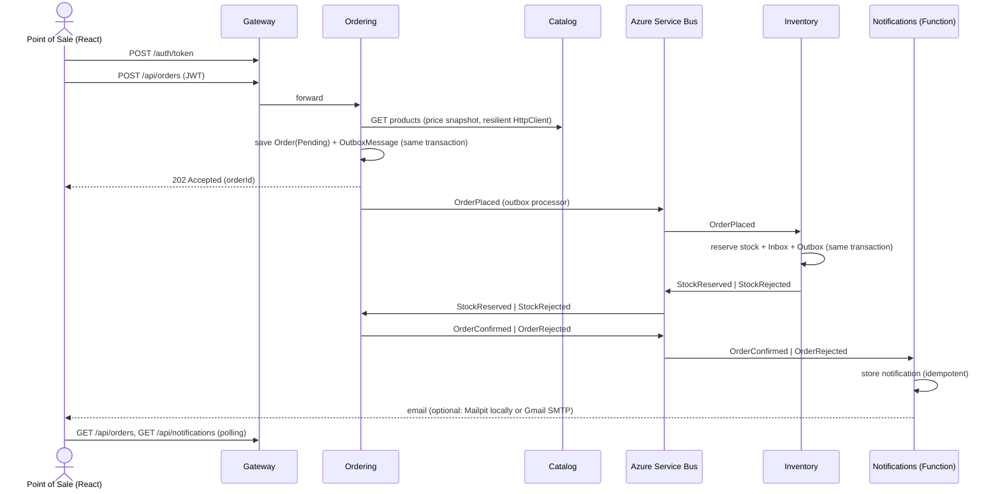

# Implementation Plan — microservices-demo

> A B2B beer ordering platform (inspired by the BEES model) built as a small but production-minded
> .NET microservices system. Scope is intentionally an **MVP deliverable in ~2 days**.

## 1. Goals

- Demonstrate, with working code, every requirement of a **Senior Backend Developer (.NET)** role:
  .NET/C#, microservices, REST APIs, PostgreSQL + EF Core, messaging (Azure Service Bus),
  Azure Functions, Docker, CI/CD, unit/integration testing, design patterns, Clean Code and AI-assisted development.
- Keep the system **small enough to explain in 10 minutes** and **run with a single command**.
- Make architectural decisions **explicit and traceable** (ADRs, patterns table, requirements map).

### Non-goals (documented as "next steps")

Kubernetes/Helm/KEDA, SonarQube, Datadog exporter, orchestrated Saga, analytics/ML, real email delivery,
a production identity provider, frontend tests.

## 2. Business flow

A point of sale (bar/market) browses the catalog, places an order, the stock is reserved,
the order is confirmed or rejected, and a notification is recorded, shown in a panel and
(optionally) sent by email.

Catalog data is **fictional** (e.g. "Golden Lager 350ml", "Amber Ale 600ml"), with a single
tongue-in-cheek nod to a famous cartoon beer: **"Duff-Style Classic Lager"**.



## 3. Architecture

```
React (Vite) ──► Gateway (YARP + JWT) ──┬─► Catalog API    ── PostgreSQL (catalogdb)
                                        ├─► Ordering API   ── PostgreSQL (orderingdb)
                                        ├─► Inventory API  ── PostgreSQL (inventorydb)
                                        └─► Notifications  ── PostgreSQL (notificationsdb)
                                              (Azure Function)

Azure Service Bus (emulator)
  topic order-events      ─ sub: inventory      (Subject = OrderPlaced)
                          ─ sub: notifications  (Subject = OrderConfirmed | OrderRejected)
  topic inventory-events  ─ sub: ordering       (Subject = StockReserved | StockRejected)
```

### Services

| Service | Style | Responsibilities | Endpoints |
|---|---|---|---|
| **Gateway** | Minimal host | YARP reverse proxy, JWT validation, demo token issuing (`bar`, `market`, `admin`), CORS, rate limiting | `POST /auth/token`, proxies `/api/*` |
| **Catalog** | Vertical Slice | Beer products (SKU, name, style, volume, pack size, price) | `GET /api/products`, `GET /api/products/{id}`, `POST/PUT /api/products` (Admin) |
| **Ordering** | Clean Architecture + DDD | Order lifecycle, discount policies, event publishing/consuming | `POST /api/orders`, `GET /api/orders`, `GET /api/orders/{id}` |
| **Inventory** | Vertical Slice | Stock per SKU, all-or-nothing reservation | `GET /api/stock`, `PUT /api/stock/{sku}` (Admin) |
| **Notifications** | Azure Function (isolated worker) | Consumes order outcome events, stores notifications, sends email (optional), exposes them | `GET /api/notifications` (HTTP trigger) |
| **Web** | React + Vite + TypeScript | Login, catalog, cart, orders (live status), notifications panel | — |

### Integration events (contracts in `BuildingBlocks.Contracts`)

| Event | Publisher | Consumers | Payload |
|---|---|---|---|
| `OrderPlaced` | Ordering | Inventory | orderId, customerId, items (sku, quantity) |
| `StockReserved` | Inventory | Ordering | orderId |
| `StockRejected` | Inventory | Ordering | orderId, reason, missing SKUs |
| `OrderConfirmed` | Ordering | Notifications | orderId, customerId, customerEmail, total |
| `OrderRejected` | Ordering | Notifications | orderId, customerId, customerEmail, reason |

Every message carries `MessageId` (idempotency), `CorrelationId` (= orderId, tracing) and `Subject` (= event type, used for subscription filters).

## 4. Design patterns — where and why

### Architectural

| Pattern | Where | Why |
|---|---|---|
| Microservices + Database per Service | Catalog, Ordering, Inventory, Notifications | Independent deployment and data ownership |
| API Gateway | `src/Gateway` | Single entry point, centralized auth and cross-cutting concerns |
| Clean Architecture | `src/Services/Ordering` | Richest domain; dependencies point inward |
| Vertical Slice Architecture | `src/Services/Catalog`, `src/Services/Inventory` | CRUD-like services; less ceremony |
| CQRS (lightweight) | `Ordering.Application` commands/queries | Writes go through the aggregate; reads use `AsNoTracking` projections |
| Publish/Subscribe (event-driven) | Service Bus topics | Temporal and spatial decoupling |
| Choreography Saga + Compensation | Order flow | Eventual consistency without distributed transactions |
| Transactional Outbox | `BuildingBlocks.Messaging` used by Ordering and Inventory | Atomic "save state + publish event" |
| Idempotent Consumer (Inbox) | Inventory, Ordering consumers, Notifications | Service Bus delivers at-least-once |
| Dead-Letter Queue | Service Bus subscriptions (max delivery count) | Poison messages do not block processing |
| Retry + Circuit Breaker + Timeout (Polly) | Ordering → Catalog `HttpClient`: explicit Polly v8 pipeline (`AddResilienceHandler("catalog", ...)` with `AddRetry` — exponential backoff + jitter, `AddCircuitBreaker`, `AddTimeout`) | Transient fault tolerance; fail fast when Catalog is down instead of piling up requests |
| Health Check | All services (`/health`, `/alive` via ServiceDefaults) | Operability |
| Token-based authentication (zero trust) | Gateway issues, **every service validates** | The Gateway is a convenience, not the security boundary: being on the internal network is not a credential |
| Token relay (on-behalf-of) | Ordering → Catalog (`AccessTokenPropagationHandler`) | The downstream call carries the point of sale's identity instead of a shared service account |
| Rate Limiting | Gateway (`api`, `auth` fixed windows partitioned per caller) | One noisy client cannot spend everybody else's budget; `/auth/token` is the one endpoint worth guessing at |

### Domain-Driven Design (Ordering)

| Pattern | Where |
|---|---|
| Aggregate Root | `Order` (owns `OrderItem`s) |
| Value Object | `Money`, `Sku`, `Quantity` |
| Domain Events | `OrderPlacedDomainEvent`, `OrderConfirmedDomainEvent`, `OrderRejectedDomainEvent` → mapped to outbox messages |
| Factory Method | `Order.Place(...)` enforces invariants at creation |
| State Machine (guarded transitions) | `Pending → Confirmed | Rejected`; invalid transitions return domain errors |
| Guard Clauses | Aggregate and value object constructors |

### Design (GoF and others)

| Pattern | Where |
|---|---|
| Repository + Unit of Work | `IOrderRepository`, `OrderingDbContext` as UoW (Catalog/Inventory use `DbContext` directly — see ADR) |
| Strategy | `IDiscountPolicy`: `VolumeDiscountPolicy`, `NoDiscountPolicy` |
| Decorator | `ValidationDecorator<TCommand>`, `LoggingDecorator<TCommand>` around command handlers |
| Adapter | `IEventBus` → `AzureServiceBusEventBus`; `IEmailSender` → `SmtpEmailSender` (MailKit) |
| Null Object | `NoOpEmailSender` when `Email:Enabled = false` — no `if` checks spread through the code |
| Result Pattern | `Result` / `Result<T>` + `Error`, mapped to RFC 9457 `ProblemDetails` |
| Object Mapping (Mapster) | Ordering and Inventory: `IRegister` configs + `IMapper`, `ProjectToType<T>()` for EF reads. **Catalog maps by hand on purpose** (expression projection + `FromProduct`) to show both approaches side by side |
| Options Pattern | `PricingOptions` (currency + discount tiers), `CatalogClientOptions`, `OutboxOptions`, `JwtOptions` |
| Dependency Injection | Everywhere |
| Test Data Builder | `OrderBuilder` in tests |

## 5. Tech stack

| Area | Choice |
|---|---|
| Runtime | .NET 10 (LTS), C# 14 |
| Local orchestration | .NET Aspire (AppHost + ServiceDefaults) |
| APIs | ASP.NET Core Minimal APIs, OpenAPI + Scalar, ProblemDetails |
| Validation | FluentValidation |
| Mapping | Mapster (MIT) in runtime mode: `TypeAdapterConfig` in DI (`IMapper` via `Mapster.DependencyInjection`), one `IRegister` per area, `ProjectToType<T>()` for queries; the config is compiled in a test so broken mappings fail the build, not a request. Catalog stays manual as the reference |
| Persistence | PostgreSQL, EF Core 10 (Npgsql), migrations |
| Messaging | Azure Service Bus emulator, `Azure.Messaging.ServiceBus` SDK |
| Serverless | Azure Functions v4, isolated worker |
| Gateway | YARP (routes, clusters and per-route policies from configuration; destinations are Aspire service discovery names) |
| Email | MailKit (SMTP); Mailpit container locally, Gmail SMTP optional |
| Auth | JWT Bearer (HS256 symmetric key, demo accounts). The Gateway issues, every service validates; endpoints are authenticated by default |
| API protection | ASP.NET Core rate limiting (fixed window per caller) and CORS restricted to the configured web origins |
| Resilience | **Polly v8** through `Microsoft.Extensions.Http.Resilience`. ServiceDefaults keeps the standard handler for generic clients; the Catalog client replaces it (`RemoveAllResilienceHandlers()`) with an explicit Polly pipeline so handlers are never stacked. |
| Observability | OpenTelemetry (traces, metrics, logs) → Aspire dashboard |
| Tests | xUnit, NSubstitute, Shouldly, Testcontainers (PostgreSQL), `WebApplicationFactory`, NetArchTest |
| Frontend | React, Vite, TypeScript, plain CSS |
| Containers | Multi-stage Dockerfiles, docker-compose |
| CI | GitHub Actions |
| Build hygiene | `global.json`, `Directory.Build.props`, Central Package Management, `.editorconfig`, nullable + warnings as errors |

## 6. Repository layout

```
microservices-demo/
├─ src/
│  ├─ AppHost/                      Aspire orchestration
│  ├─ ServiceDefaults/              OpenTelemetry, health checks, resilience, service discovery
│  ├─ BuildingBlocks/
│  │  ├─ BuildingBlocks.Common/     Result, Error, guard helpers
│  │  ├─ BuildingBlocks.Contracts/  Integration events
│  │  ├─ BuildingBlocks.Messaging/  IEventBus, Service Bus adapter, Outbox, Inbox, consumer host
│  │  └─ BuildingBlocks.Web/        Result → ProblemDetails, validation filter, endpoint discovery
│  ├─ Gateway/
│  ├─ Services/
│  │  ├─ Catalog/Catalog.Api/
│  │  ├─ Ordering/Ordering.Domain | Ordering.Application | Ordering.Infrastructure | Ordering.Api
│  │  └─ Inventory/Inventory.Api/
│  ├─ Functions/Notifications/
│  └─ Web/                          React app
├─ tests/
│  ├─ Ordering.Domain.UnitTests/
│  ├─ Ordering.Application.UnitTests/
│  ├─ Inventory.UnitTests/
│  ├─ Ordering.IntegrationTests/
│  ├─ Gateway.Tests/
│  └─ Architecture.Tests/
├─ docs/
│  ├─ implementation-plan.md
│  ├─ postman/                      One collection per service (with tests) + local environment
│  ├─ job-requirements.md
│  ├─ ai-workflow.md
│  └─ adr/
├─ .github/workflows/ci.yml
├─ docker-compose.yml
├─ CLAUDE.md
├─ README.md
└─ README_pt.md                     (last step)
```

### Configuration and secrets

No secret is ever committed. Settings are read through the Options pattern from:

- **Aspire (local):** AppHost parameters backed by .NET user-secrets (`dotnet user-secrets set ...`).
- **docker-compose / CI:** environment variables from a git-ignored `.env` file; `.env.example` is committed.

Email settings:

| Variable | Default | Description |
|---|---|---|
| `Email__Enabled` | `true` | `false` registers `NoOpEmailSender` |
| `Email__Host` | `localhost` (Mailpit) | `smtp.gmail.com` for Gmail |
| `Email__Port` | `1025` (Mailpit) | `587` (STARTTLS) for Gmail |
| `Email__Username` / `Email__Password` | empty | Gmail address + **App Password** (requires 2FA) |
| `Email__From` | `no-reply@microservices-demo.local` | Sender address |
| `DemoUsers__bar__Email` | `bar@example.com` | The e-mail claim of the `bar` account, and therefore the recipient of its order e-mails; set to a real inbox to receive them |

By default emails are captured by **Mailpit** (web UI on `http://localhost:8025`), so the project runs
for anyone who clones it without credentials.

## 7. Testing strategy

| Level | Project | What |
|---|---|---|
| Unit | `Ordering.Domain.UnitTests` | Aggregate invariants, state transitions, discount strategies, value objects |
| Unit | `Ordering.Application.UnitTests` | Place-order handler (Catalog snapshot, unknown SKU, Catalog down), validation decorator, strict Mapster config compile |
| Unit | `Inventory.UnitTests` | All-or-nothing reservation rules |
| Integration | `Ordering.IntegrationTests` | API + EF Core against real PostgreSQL (Testcontainers); asserts order and outbox row are written atomically; token validation (401 without, with a foreign key, without claims); `IEventBus` faked |
| Functional | `Gateway.Tests` | The real Gateway in memory (`WebApplicationFactory`, no backend): token issuing and its failure modes, 401 before proxying, 403 for the wrong role, CORS preflight allowed and refused |
| Architecture | `Architecture.Tests` | Domain has no dependency on Application/Infrastructure or frameworks; Application has no dependency on Infrastructure, EF Core, ASP.NET Core, Service Bus or HTTP; command handlers are internal and sealed; endpoints do not use Infrastructure |

Principle: fast tests on business rules, real infrastructure where mocks would lie (database), coverage as a signal, not a goal.

## 8. CI (GitHub Actions)

`ci.yml`, triggered on push and pull request to `main`:

1. **backend** — setup .NET 10 → restore → build (warnings as errors) → unit + architecture tests → integration tests (Testcontainers on the Ubuntu runner) → publish test results.
2. **frontend** — `npm ci` → lint → build.
3. **docker** (needs backend + frontend) — build every image (no push).

## 9. Phases and checkpoints

Work proceeds phase by phase, **one working session per phase** (see [Working sessions](#working-sessions)).
**At the end of each phase: explain what was built and why, wait for approval, then commit** (Conventional Commits),
push, and update the **Status** column and the phase notes below.

| # | Phase | Status | Deliverables | Suggested commits |
|---|---|---|---|---|
| 0 | Plan & repo foundation | ✅ Done | This plan, `global.json`, `Directory.Build.props`, `Directory.Packages.props`, `.editorconfig`, solution (`.slnx`), `CLAUDE.md` | `docs: add implementation plan`, `build: add solution and shared build configuration` |
| 1 | Aspire & building blocks | ✅ Done | AppHost (PostgreSQL, Service Bus emulator with topics/subscriptions), ServiceDefaults, `Result`, contracts, `IEventBus`, Outbox/Inbox + processor, Service Bus smoke test tool | `feat(building-blocks): ...`, `feat(apphost): ...`, `chore(tools): ...` |
| 2 | Catalog | ✅ Done | Entity, EF configuration, migration, seed (fictional brands + "Duff-Style Classic Lager"), endpoints, validation, ProblemDetails mapping for `Result` | `feat(catalog): ...` |
| 3 | Ordering domain | ✅ Done | Aggregate, value objects, domain events, discount strategies + unit tests | `feat(ordering): add order aggregate`, `test(ordering): ...` |
| 4 | Ordering application & API | ✅ Done | Commands/queries, decorators, repository, EF, outbox, Catalog client with Polly pipeline, consumers, Mapster read mappings (aggregate → DTO only), integration test, architecture tests | `feat(ordering): ...`, `test: ...` |
| 5 | Inventory & end-to-end flow | ✅ Done | Stock model, reservation consumer (inbox + outbox, optimistic concurrency), endpoints with Mapster projections, unit tests; full flow verified in Aspire | `feat(inventory): ...` |
| 6 | Gateway & auth | ✅ Done | YARP routes, `/auth/token`, JWT validation in gateway and services, CORS | `feat(gateway): ...` |
| 7 | Notifications | ⏳ Next | Function with Service Bus trigger, idempotent storage, email sender (Mailpit/Gmail, toggleable), HTTP trigger for the panel | `feat(notifications): ...` |
| 8 | Web | ⬜ | Login, catalog, cart, orders with live status, notifications panel | `feat(web): ...` |
| 9 | Containers & CI | ⬜ | Dockerfiles, `docker-compose.yml`, GitHub Actions workflow green | `build(docker): ...`, `ci: ...` |
| 10 | Documentation | ⬜ | `README.md` (patterns, how to run, demo script), `job-requirements.md`, ADRs, `ai-workflow.md`, then `README_pt.md` | `docs: ...` |

### Phase notes

Decisions and facts discovered during implementation that the next phases depend on.

- **Phase 1**
  - Service Bus is consumed through `builder.AddServiceBusMessaging()`, `services.AddOutbox<TDbContext>()`, `services.AddIntegrationEventHandler<TEvent, THandler>()` and `services.AddServiceBusSubscription<TDbContext>(Topology.Subscriptions.X)`.
  - Each service `DbContext` must call `modelBuilder.AddMessagingTables()` (outbox/inbox, snake_case table and column names).
  - Integration event handlers must **not** call `SaveChangesAsync`; the consumer pipeline saves business change + inbox record atomically.
  - Emulator AMQP port is fixed to `5672`; `tools/servicebus-smoke.cs` sends/peeks/receives against it.
  - Database resource names in the AppHost: `catalogdb`, `orderingdb`, `inventorydb`, `notificationsdb`.
  - `ServiceDefaults` adds `AddStandardResilienceHandler()` to every `HttpClient`; clients with a custom Polly pipeline must call `RemoveAllResilienceHandlers()` first.
- **Phase 2**
  - `BuildingBlocks.Web` (new) is shared by every HTTP service: `AddApiProblemDetails()` + `UseApiExceptionHandling()` (all errors are RFC 9457 with `traceId`; binding errors stay 4xx), `Result.ToProblem()` (`Validation→400`, `NotFound→404`, `Conflict→409`, otherwise 500, plus a `code` extension), `.WithRequestValidation<TRequest>()` (FluentValidation endpoint filter → 400 `ValidationProblem`) and `IEndpoint` + `AddEndpoints(assembly)`/`MapEndpoints()`.
  - Vertical slice layout: `Features/<Area>/<Feature>/` with `Endpoint`, `Request`, `Handler`, `Validator`; handlers are registered explicitly in `CatalogFeatures`. Handlers return `Result<T>`; endpoints return typed `Results<...>` so OpenAPI documents every response.
  - Catalog runs as Aspire resource **`catalog`** → Ordering must use `https+http://catalog`.
  - `GET /api/products?sku=A&sku=B` returns only those SKUs (max 100, case-insensitive) — Ordering uses it to snapshot prices in one call. Response: `id, sku, name, style, volumeMl, packSize, price` (price per pack, `numeric(10,2)`; enums serialized as strings).
  - The SKU (uppercase, e.g. `GOLDEN-LAGER-350`) is the cross-service identity and is immutable (not in the PUT body). Inventory must seed stock for the 8 SKUs in `CatalogSeeder`.
  - Migrations are applied at startup and seeding uses EF Core `UseSeeding`/`UseAsyncSeeding` (only into an empty table). A design-time factory lets `dotnet ef migrations add` run without Aspire: `dotnet ef migrations add <Name> --project src/Services/Catalog/Catalog.Api --output-dir Persistence/Migrations`.
  - `POST`/`PUT` are anonymous until phase 6 (`TODO(phase 6)` marks where the Admin policy goes).
- **Phase 3**
  - `Ordering.Domain` references only `BuildingBlocks.Common` (dependency-free `Result`/`Error`). Architecture tests must allow it and forbid Application, Infrastructure, EF Core and ASP.NET Core.
  - Entry points: `Order.Place(customerId, customerEmail, lines, discountPolicy, placedOnUtc)`, `order.Confirm(utcNow)`, `order.Reject(reason, utcNow)`. Time is passed in (the application layer uses `TimeProvider`); the domain never reads the clock.
  - Guard clauses throw for programming errors (blank customer id/email or rejection reason, null lines, a discount policy returning more than the subtotal or another currency). Business rules return `Result` errors: `Orders.NoItems`, `Orders.TooManyItems` (max 50 lines), `Orders.DuplicateSku`, `Orders.MixedCurrencies` (all `Validation`) and `Orders.InvalidStatusTransition` (`Conflict`). Only `Pending` can move, to `Confirmed` or `Rejected`; both are terminal and set `CompletedOnUtc`.
  - Value objects are `sealed record`s with private constructors and `Create(...) → Result<T>`: `Money` (non-negative, max 2 decimals, upper-case ISO 4217 code; cross-currency arithmetic throws), `Sku` (trimmed, upper-case, same format and max length 50 as Catalog), `Quantity` (1–1000 packs). Phase 4 maps them as EF Core complex types/value conversions and uses the private parameterless constructors of `Order`/`OrderItem` (items live in the `_items` backing field; `OrderItem.LineTotal` is computed, not stored).
  - Catalog prices have no currency: the application layer picks the currency (configuration) when it builds `OrderLine`s from the Catalog price snapshot.
  - Aggregates collect events in `DomainEvents`; persistence must translate them to integration events in the outbox and then call `ClearDomainEvents()`. Mapping is 1:1 (`OrderPlacedDomainEvent → OrderPlaced`, `OrderConfirmedDomainEvent → OrderConfirmed`, `OrderRejectedDomainEvent → OrderRejected`); reuse `IDomainEvent.EventId` as the integration event `EventId` so a retried save cannot produce a second message.
  - Discounts use the Strategy pattern: `IDiscountPolicy.CalculateDiscount(subtotal, totalQuantity)`, implemented by `VolumeDiscountPolicy(tiers)` (highest reached tier wins; rates in (0, 0.5]; invalid tiers throw at construction) and `NoDiscountPolicy.Instance` (Null Object). Phase 4 binds `DiscountOptions` to the tiers and registers the policy.
  - Tests: `tests/Ordering.Domain.UnitTests` with xUnit v3 (VSTest runner, test projects are `OutputType=Exe`), Shouldly, NSubstitute and coverlet; `Builders/OrderBuilder` is the Test Data Builder.
- **Phase 4**
  - Projects: `Ordering.Application` (references Domain only + FluentValidation, Mapster, logging/options abstractions), `Ordering.Infrastructure` (EF Core, outbox/inbox, Catalog client, consumers, query handlers), `Ordering.Api` (endpoints + composition root). Aspire resource **`ordering`** (`http://localhost:5102`); it references `orderingdb`, `messaging` and `catalog` but does not `WaitFor` Catalog (the resilience pipeline covers it).
  - Building blocks changed: `ErrorType.Unavailable` → **503**; `ValidationError` (field → messages) → 400 with the same `errors` shape as the validation filter; `DbContext.AddToOutbox(...)` for code that cannot resolve `IOutbox`; the outbox processor runs its transaction inside `CreateExecutionStrategy()` (Aspire's Npgsql retry strategy rejects user transactions otherwise); `Messaging:Consumers:Enabled=false` stops subscription processors (integration tests).
  - CQRS: commands go through `ICommandHandler<TCommand, TResponse>` registered with `AddCommandHandler<...>()` and wrapped **logging → validation → handler** (hand-written decorators, no MediatR/Scrutor). Queries implement `IQueryHandler<,>` **in Infrastructure** (`AsNoTracking` + `ProjectToType`), so the read side never loads aggregates.
  - `PlaceOrderCommand` commits through `IUnitOfWork`. `ConfirmOrderCommand` / `RejectOrderCommand` do **not** commit: they run inside the consumer pipeline, which saves the change, the outcome outbox row and the inbox record together. Consumers (`StockReserved/StockRejectedIntegrationEventHandler`) complete a `Conflict` (order no longer Pending) and throw anything else (e.g. unknown order → retries → DLQ).
  - Domain events → outbox: `DomainEventsToOutboxInterceptor` (stateless `SaveChangesInterceptor`, added in `AddNpgsqlDbContext`) maps them with `IntegrationEventMapper` (manual, domain `EventId` reused) and `CorrelationId = orderId`. Inventory should follow the same idea (outbox row in the same `SaveChanges`).
  - Persistence: tables `orders`, `order_items`, `outbox_messages`, `inbox_messages`. `Money`, `Sku` and `Quantity` are EF **complex types** (not value converters) so projections such as `Sku.Value` translate to SQL; `LineTotal` is not stored; `xmin` is the optimistic concurrency token. Migrations: `dotnet ef migrations add <Name> --project src/Services/Ordering/Ordering.Infrastructure --startup-project src/Services/Ordering/Ordering.Infrastructure --output-dir Persistence/Migrations`.
  - Catalog client: typed `HttpClient` at `https+http://catalog`, `RemoveAllResilienceHandlers()` (experimental `EXTEXP0001`, suppressed locally) then `AddResilienceHandler("catalog")`: total timeout 10 s → retry ×3 exponential + jitter → circuit breaker (50 % over 30 s, min 5 calls, open 15 s) → attempt timeout 2 s (section `Catalog`). What survives the pipeline becomes `Catalog.Unavailable` (503). Verified live: first call ~9 s of retries, then fail-fast in ~10 ms while open.
  - Mapster: `DependencyInjection.CreateMappingConfig()` is strict (`RequireExplicitMapping`, `RequireDestinationMemberSource`); `OrderMappingRegister` maps `Order → OrderResponse | OrderSummaryResponse`, `OrderItem → OrderItemResponse` with plain expressions (items ordered by SKU, line total rounded to cents) so the same config serves `Map` and `ProjectToType`; unit tests call `Compile()` and `CompileProjection()`.
  - API: `POST /api/orders` → **202** + `Location` + `OrderResponse` (Pending); `GET /api/orders` (summaries, newest first, max 100); `GET /api/orders/{id}` (404 for another customer's order). Enums serialized as strings. Pricing: section `Pricing` (`Currency` USD, tiers 20 packs → 5 %, 50 → 10 %).
  - Customer identity is temporary: `CurrentCustomer` binds `X-Customer-Id` / `X-Customer-Email`, falling back to `DemoUsers:PointOfSale` (`bar`, `bar@example.com`). `TODO(phase 6)` replaces it with JWT claims.
  - Tests: `Ordering.Application.UnitTests` (new, 18), `Ordering.IntegrationTests` (11, `WebApplicationFactory` + Testcontainers `postgres:17-alpine`, fakes for `IEventBus` and `ICatalogClient`), `Architecture.Tests` (7, NetArchTest). Full flow checked against Aspire: `OrderPlaced` reaches `order-events/inventory`; `StockReserved`/`StockRejected` sent twice with the same `MessageId` produce one transition, one outcome event and one inbox row.
- **Phase 5**
  - One project, `Inventory.Api` (Vertical Slice), Aspire resource **`inventory`** (`http://localhost:5103`); it references `inventorydb` and `messaging` only — nothing calls it synchronously, orders reach it through the topic.
  - Domain (public, so unit tests reach it): `StockItem` (packs, `QuantityAvailable` / `QuantityReserved`, `Reserve`, `SetQuantityAvailable`, `NormalizeSku`) and the pure function `StockReservation.Reserve(stockItems, lines, utcNow) → ReservationOutcome`. **All-or-nothing:** every line is checked before anything is reserved; the outcome carries the reason (`UnknownSkuReason`, `InsufficientStockReason` or both) and the sorted list of SKUs that blocked it. Repeated SKUs are added up; guard clauses throw for a reservation with no lines or a non-positive quantity (a malformed message is retried and dead-lettered).
  - A rejection is a normal business outcome (it becomes an event), so it is a `ReservationOutcome`, not a `Result` failure. `Result` is still used for the HTTP slices.
  - `OrderPlacedIntegrationEventHandler` loads the SKUs **tracked**, reserves and stages `StockReserved` / `StockRejected` through `IOutbox` with `CorrelationId = orderId`. It never calls `SaveChangesAsync`: the consumer pipeline commits stock + outbox + inbox in one transaction.
  - Persistence: tables `stock_items`, `outbox_messages`, `inbox_messages`; unique index on `sku`, check constraint `quantity_available >= 0 AND quantity_reserved >= 0`, `xmin` as the optimistic concurrency token (a lost update makes the save fail → message abandoned → retried against fresh quantities). Migrations: `dotnet ef migrations add <Name> --project src/Services/Inventory/Inventory.Api --output-dir Persistence/Migrations`.
  - `InventorySeeder` repeats the 8 SKUs of `CatalogSeeder` (Inventory must not reference Catalog); `MIDNIGHT-STOUT-500` starts with only 5 packs so the demo can show a rejected order.
  - API: `GET /api/stock` (all rows or `?sku=A&sku=B`, max 100, sorted by SKU, `ProjectToType<StockResponse>()`), `PUT /api/stock/{sku}` (sets the available quantity; reserved packs are untouched; **404** for a SKU with no stock row, so a typo cannot invent a product). `TODO(phase 6)` marks the Admin policy. `StockResponse` exposes `quantityOnHand = available + reserved`, computed in SQL.
  - Mapster: `InventoryMapping.CreateMappingConfig()` (strict) + `StockMappingRegister`; unit tests call `Compile()` and `CompileProjection()`.
  - Reserved packs are never released (there is no order cancellation and no shipping step), which is why a separate reservation table is not needed yet. Releasing on `OrderRejected` and committing on shipment is the natural next step.
  - Tests: `Inventory.UnitTests` (18). Full flow checked against Aspire: order within stock → `Confirmed` in ~3.5 s with 100 → 98 available / 0 → 2 reserved; order with 1000 packs of the short SKU → `Rejected` with reason `Not enough stock for some products. (MIDNIGHT-STOUT-500)` and **nothing** reserved for its available line; the same `OrderPlaced` sent twice with one `MessageId` produced one reservation, one inbox row and one `StockReserved`.
- **Phase 6**
  - One project, `src/Gateway` (`Gateway.csproj`), Aspire resource **`gateway`** (`http://localhost:5100`, `WithExternalHttpEndpoints`). It references `catalog`, `ordering` and `inventory` for service discovery and owns nothing else: no database, no messaging.
  - `BuildingBlocks.Web` gained the authentication half everyone shares: `JwtOptions` (section `Jwt`: `SigningKey`, `Issuer` `microservices-demo`, `Audience` `microservices-demo-api`, `Lifetime`, `ClockSkew`; data-annotation validated with `ValidateOnStart`), `AddJwtAuthentication()`, `JwtClaimNames` (`sub`, `email`, `role`, `name`), `Roles` (`PointOfSale`, `Admin`), `AuthorizationPolicies.Admin`, `RequireAdmin()` and `AddBearerSecurityScheme()` for the OpenAPI document. `ErrorType.Unauthorized` → **401** was added to `BuildingBlocks.Common`.
  - **Secure by default:** `AddJwtAuthentication()` sets a *fallback* authorization policy (`RequireAuthenticatedUser`), so a new endpoint is protected unless it says `AllowAnonymous`. The exceptions are health probes (`MapDefaultEndpoints`, an orchestrator has no token) and `MapOpenApi`/`MapScalarApiReference`. `MapInboundClaims = false`: claims keep the names the token uses.
  - **Every service validates the token itself** (`Catalog`, `Ordering`, `Inventory` all call `AddJwtAuthentication()` + `UseAuthentication/UseAuthorization`). Being inside the cluster is not a credential; the Gateway is a convenience, not the security boundary.
  - `POST /auth/token` (Gateway only) exchanges demo credentials for an HS256 JWT signed by `DemoTokenIssuer` — the single place in the solution that *creates* a token. Wrong password and unknown user return the same `Auth.InvalidCredentials` 401 (no account enumeration) and the password comparison is constant time. Accounts live in section `DemoUsers` (`bar`, `market` → `PointOfSale`; `admin` → `Admin`; password `demo`): **demo credentials on purpose, not secrets**, so the repository runs for anyone who clones it. A production system swaps this endpoint for an identity provider and keeps only the validation half.
  - The **signing key is a real secret**: AppHost parameter `jwt-signing-key` (`GenerateParameterDefault`, `secret: true`, `persist: true`) generated on first run into the AppHost user-secrets and injected into all four projects as `Jwt__SigningKey`. docker-compose (phase 9) reads it from `.env`.
  - YARP routes and clusters are configuration (`ReverseProxy` section), destinations are service discovery names (`https+http://catalog`) resolved by `AddServiceDiscoveryDestinationResolver()`. Routes are split by method so the policy is part of the route: `catalog-read`/`inventory-read`/`ordering` use `default` (authenticated), `catalog-admin` (`POST`,`PUT /api/products`) and `inventory-admin` (`PUT /api/stock`) use `Admin`. `/api/notifications` is added in phase 7.
  - Middleware order in the Gateway: exception handling → **CORS** → authentication → authorization → rate limiter → endpoints → `MapReverseProxy`. CORS runs first so a browser preflight is answered before authorization can reject it for having no token. Allowed origins come from section `Cors` (never `*`); `Location` is exposed for the 202 of *place order*.
  - Rate limiting: fixed window partitioned by `sub` (or remote IP when anonymous). Policy `api` (100 / 10 s) on the proxied routes, `auth` (10 / min) on `/auth/token`. Rejections are 429 and `UseStatusCodePages` turns them into ProblemDetails like everything else.
  - **Ordering identity now comes from the token:** `CurrentCustomer` binds `sub`/`email` (the `X-Customer-*` headers and `DemoCustomerOptions` are gone) and throws `BadHttpRequestException(401)` for a token that validates but identifies nobody.
  - **Service-to-service calls relay the caller's token** (`IAccessTokenProvider` port in `Ordering.Application`, `HttpContextAccessTokenProvider` in `Ordering.Api`, `AccessTokenPropagationHandler` in `Ordering.Infrastructure`, outside the Polly pipeline). The port keeps ASP.NET Core out of the inner layers. Client credentials for machine-to-machine calls is the natural next step; here Ordering genuinely acts *on behalf of* the point of sale. A 401/403 from Catalog is logged apart from a transient fault so a bad key is not mistaken for an outage.
  - Tests: `Gateway.Tests` (new, 12 — token issuing, bad credentials, 401 before proxying, 403 for the wrong role, CORS preflight allowed and refused) and `Ordering.IntegrationTests` (+4 authentication tests, `TestTokens` signs them without involving the Gateway). Verified live in Aspire end to end through the Gateway: sign in → place order → `Confirmed` with stock moved, `market` gets 404 for `bar`'s order, `PointOfSale` gets 403 on `PUT /api/stock`, `/auth/token` answers 429 after 10 calls. All four Postman collections pass with newman (145 assertions).
- **Configuration**
  - `.env.example` (committed) lists every variable for docker-compose; `.env` (git-ignored) holds local values.
  - Aspire does not read `.env`: AppHost parameters (`builder.AddParameter(name, secret: true)`) live in the AppHost user-secrets. Aspire already stores its generated `postgres-password` and `messaging-sql-pwd` there.
  - Setting names are shared by both paths: `Jwt:*`, `DemoUsers:*`, `Email:*` (env var form `Jwt__SigningKey`, etc.).
  - `Jwt:SigningKey` is the only value every project must agree on. Locally the AppHost generates and persists it (`jwt-signing-key`); for docker-compose it comes from `.env`. Demo account passwords are **not** secrets and stay in the Gateway's `appsettings.json`.

### Working sessions

To keep each AI session small and focused:

1. Start a **new session per phase**. The repository is the memory: this plan (status + phase notes), `CLAUDE.md` and the git history.
2. Kick-off prompt: *"Read CLAUDE.md and docs/implementation-plan.md. Implement phase N only. Stop for review before committing."*
3. Close the phase by updating the Status column and adding its phase notes in the same commit.

**Day 1:** phases 0–5. **Day 2:** phases 6–10 + demo rehearsal.

If time runs short, cut in this order: phase 8 polish → docker-compose (keep Dockerfiles) → Inventory unit tests. The event flow (phases 4–5) is never cut.

## 10. Planned ADRs

1. `0001-azure-service-bus-without-messaging-framework.md` — why the SDK + hand-written outbox/inbox instead of MassTransit (licensing, emulator topology limits, visibility of the pattern).
2. `0002-architecture-style-per-service.md` — Clean Architecture for Ordering, Vertical Slice for Catalog/Inventory.
3. `0003-choreography-over-orchestration.md` — why choreography for a three-step flow, and when an orchestrated Saga would be preferred.
4. `0004-yarp-as-api-gateway.md` — YARP (in-process .NET, code/config based) vs Kong or Azure API Management, and how it would evolve in production.
5. `0005-object-mapping-mapster-and-manual.md` — Mapster (MIT, `ProjectToType` SQL projections) vs AutoMapper (commercial license) vs hand-written mapping; why Catalog stays manual and why mappings never create aggregates.

## 11. Demo script (5–10 minutes)

1. Repository tour: layout, `job-requirements.md`, patterns table.
2. `dotnet run --project src/AppHost` → Aspire dashboard (resources, PostgreSQL, Service Bus emulator).
3. Web: log in, browse catalog, place an order within stock → status goes `Pending → Confirmed`, notification appears and the email arrives.
4. Place an order exceeding stock → `Rejected` (compensation path).
5. Aspire traces: one distributed trace across Gateway → Ordering → Service Bus → Inventory → Ordering → Notifications.
6. Code walkthrough: `Order` aggregate, outbox processor, idempotent consumer, discount strategy.
7. Tests and the green GitHub Actions run.

## 12. Risks and mitigations

| Risk | Mitigation |
|---|---|
| Service Bus emulator needs SQL Server (memory heavy) | Docker Desktop with ≥ 6 GB RAM; emulator started once and kept running |
| Emulator subscription rule filters misbehave | Consumers also ignore unknown `Subject` values (defensive) |
| Azure Functions + .NET 10 isolated worker / container image availability | Verify early in phase 7; fall back to .NET 8 for the Function project only |
| Azure Functions Core Tools missing locally | Install `azure-functions-core-tools@4` before phase 7 |
| Gmail rejects SMTP login | Use an App Password; Mailpit remains the default so the demo never depends on Gmail |
| Time | Strict phase order and cut list (section 9) |

## 13. Prerequisites

- .NET SDK 10
- Docker Desktop (running)
- Node.js 22+
- Azure Functions Core Tools v4
