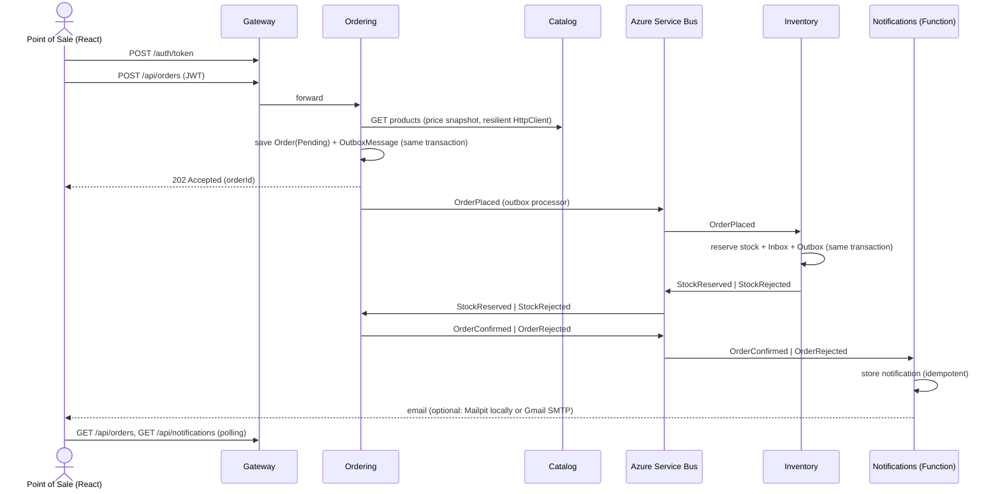

# Implementation Plan — microservices-demo

> A B2B beer ordering platform (inspired by the BEES model) built as a small but production-minded
> .NET microservices system. Scope is intentionally an **MVP deliverable in ~2 days**.

## 1. Goals

- Demonstrate, with working code, every requirement of a **Senior Backend Developer (.NET)** role:
  .NET/C#, microservices, REST APIs, PostgreSQL + EF Core, messaging (Azure Service Bus),
  Azure Functions, Docker, CI/CD, unit/integration testing, design patterns, Clean Code and AI-assisted development.
- Keep the system **small enough to explain in 10 minutes** and **run with a single command**.
- Make architectural decisions **explicit and traceable** (ADRs, patterns table, requirements map).

### Non-goals (documented as "next steps")

Kubernetes/Helm/KEDA, SonarQube, Datadog exporter, orchestrated Saga, analytics/ML, real email delivery,
a production identity provider, frontend tests.

## 2. Business flow

A point of sale (bar/market) browses the catalog, places an order, the stock is reserved,
the order is confirmed or rejected, and a notification is recorded, shown in a panel and
(optionally) sent by email.

Catalog data is **fictional** (e.g. "Golden Lager 350ml", "Amber Ale 600ml"), with a single
tongue-in-cheek nod to a famous cartoon beer: **"Duff-Style Classic Lager"**.



## 3. Architecture

```
React (Vite) ──► Gateway (YARP + JWT) ──┬─► Catalog API    ── PostgreSQL (catalogdb)
                                        ├─► Ordering API   ── PostgreSQL (orderingdb)
                                        ├─► Inventory API  ── PostgreSQL (inventorydb)
                                        └─► Notifications  ── PostgreSQL (notificationsdb)
                                              (Azure Function)

Azure Service Bus (emulator)
  topic order-events      ─ sub: inventory      (Subject = OrderPlaced)
                          ─ sub: notifications  (Subject = OrderConfirmed | OrderRejected)
  topic inventory-events  ─ sub: ordering       (Subject = StockReserved | StockRejected)
```

### Services

| Service | Style | Responsibilities | Endpoints |
|---|---|---|---|
| **Gateway** | Minimal host | YARP reverse proxy, JWT validation, demo token issuing, CORS, rate limiting | `POST /auth/token`, proxies `/api/*` |
| **Catalog** | Vertical Slice | Beer products (SKU, name, style, volume, pack size, price) | `GET /api/products`, `GET /api/products/{id}`, `POST/PUT /api/products` (Admin) |
| **Ordering** | Clean Architecture + DDD | Order lifecycle, discount policies, event publishing/consuming | `POST /api/orders`, `GET /api/orders`, `GET /api/orders/{id}` |
| **Inventory** | Vertical Slice | Stock per SKU, all-or-nothing reservation | `GET /api/stock`, `PUT /api/stock/{sku}` (Admin) |
| **Notifications** | Azure Function (isolated worker) | Consumes order outcome events, stores notifications, sends email (optional), exposes them | `GET /api/notifications` (HTTP trigger) |
| **Web** | React + Vite + TypeScript | Login, catalog, cart, orders (live status), notifications panel | — |

### Integration events (contracts in `BuildingBlocks.Contracts`)

| Event | Publisher | Consumers | Payload |
|---|---|---|---|
| `OrderPlaced` | Ordering | Inventory | orderId, customerId, items (sku, quantity) |
| `StockReserved` | Inventory | Ordering | orderId |
| `StockRejected` | Inventory | Ordering | orderId, reason, missing SKUs |
| `OrderConfirmed` | Ordering | Notifications | orderId, customerId, customerEmail, total |
| `OrderRejected` | Ordering | Notifications | orderId, customerId, customerEmail, reason |

Every message carries `MessageId` (idempotency), `CorrelationId` (= orderId, tracing) and `Subject` (= event type, used for subscription filters).

## 4. Design patterns — where and why

### Architectural

| Pattern | Where | Why |
|---|---|---|
| Microservices + Database per Service | Catalog, Ordering, Inventory, Notifications | Independent deployment and data ownership |
| API Gateway | `src/Gateway` | Single entry point, centralized auth and cross-cutting concerns |
| Clean Architecture | `src/Services/Ordering` | Richest domain; dependencies point inward |
| Vertical Slice Architecture | `src/Services/Catalog`, `src/Services/Inventory` | CRUD-like services; less ceremony |
| CQRS (lightweight) | `Ordering.Application` commands/queries | Writes go through the aggregate; reads use `AsNoTracking` projections |
| Publish/Subscribe (event-driven) | Service Bus topics | Temporal and spatial decoupling |
| Choreography Saga + Compensation | Order flow | Eventual consistency without distributed transactions |
| Transactional Outbox | `BuildingBlocks.Messaging` used by Ordering and Inventory | Atomic "save state + publish event" |
| Idempotent Consumer (Inbox) | Inventory, Ordering consumers, Notifications | Service Bus delivers at-least-once |
| Dead-Letter Queue | Service Bus subscriptions (max delivery count) | Poison messages do not block processing |
| Retry + Circuit Breaker + Timeout (Polly) | Ordering → Catalog `HttpClient`: explicit Polly v8 pipeline (`AddResilienceHandler("catalog", ...)` with `AddRetry` — exponential backoff + jitter, `AddCircuitBreaker`, `AddTimeout`) | Transient fault tolerance; fail fast when Catalog is down instead of piling up requests |
| Health Check | All services (`/health`, `/alive` via ServiceDefaults) | Operability |

### Domain-Driven Design (Ordering)

| Pattern | Where |
|---|---|
| Aggregate Root | `Order` (owns `OrderItem`s) |
| Value Object | `Money`, `Sku`, `Quantity` |
| Domain Events | `OrderPlacedDomainEvent`, `OrderConfirmedDomainEvent`, `OrderRejectedDomainEvent` → mapped to outbox messages |
| Factory Method | `Order.Place(...)` enforces invariants at creation |
| State Machine (guarded transitions) | `Pending → Confirmed | Rejected`; invalid transitions return domain errors |
| Guard Clauses | Aggregate and value object constructors |

### Design (GoF and others)

| Pattern | Where |
|---|---|
| Repository + Unit of Work | `IOrderRepository`, `OrderingDbContext` as UoW (Catalog/Inventory use `DbContext` directly — see ADR) |
| Strategy | `IDiscountPolicy`: `VolumeDiscountPolicy`, `NoDiscountPolicy` |
| Decorator | `ValidationDecorator<TCommand>`, `LoggingDecorator<TCommand>` around command handlers |
| Adapter | `IEventBus` → `AzureServiceBusEventBus`; `IEmailSender` → `SmtpEmailSender` (MailKit) |
| Null Object | `NoOpEmailSender` when `Email:Enabled = false` — no `if` checks spread through the code |
| Result Pattern | `Result` / `Result<T>` + `Error`, mapped to RFC 9457 `ProblemDetails` |
| Options Pattern | `ServiceBusOptions`, `JwtOptions`, `DiscountOptions` |
| Dependency Injection | Everywhere |
| Test Data Builder | `OrderBuilder` in tests |

## 5. Tech stack

| Area | Choice |
|---|---|
| Runtime | .NET 10 (LTS), C# 14 |
| Local orchestration | .NET Aspire (AppHost + ServiceDefaults) |
| APIs | ASP.NET Core Minimal APIs, OpenAPI + Scalar, ProblemDetails |
| Validation | FluentValidation |
| Persistence | PostgreSQL, EF Core 10 (Npgsql), migrations |
| Messaging | Azure Service Bus emulator, `Azure.Messaging.ServiceBus` SDK |
| Serverless | Azure Functions v4, isolated worker |
| Gateway | YARP |
| Email | MailKit (SMTP); Mailpit container locally, Gmail SMTP optional |
| Auth | JWT Bearer (symmetric key, demo users) |
| Resilience | **Polly v8** through `Microsoft.Extensions.Http.Resilience`. ServiceDefaults keeps the standard handler for generic clients; the Catalog client replaces it (`RemoveAllResilienceHandlers()`) with an explicit Polly pipeline so handlers are never stacked. |
| Observability | OpenTelemetry (traces, metrics, logs) → Aspire dashboard |
| Tests | xUnit, NSubstitute, Shouldly, Testcontainers (PostgreSQL), `WebApplicationFactory`, NetArchTest |
| Frontend | React, Vite, TypeScript, plain CSS |
| Containers | Multi-stage Dockerfiles, docker-compose |
| CI | GitHub Actions |
| Build hygiene | `global.json`, `Directory.Build.props`, Central Package Management, `.editorconfig`, nullable + warnings as errors |

## 6. Repository layout

```
microservices-demo/
├─ src/
│  ├─ AppHost/                      Aspire orchestration
│  ├─ ServiceDefaults/              OpenTelemetry, health checks, resilience, service discovery
│  ├─ BuildingBlocks/
│  │  ├─ BuildingBlocks.Common/     Result, Error, guard helpers
│  │  ├─ BuildingBlocks.Contracts/  Integration events
│  │  └─ BuildingBlocks.Messaging/  IEventBus, Service Bus adapter, Outbox, Inbox, consumer host
│  ├─ Gateway/
│  ├─ Services/
│  │  ├─ Catalog/Catalog.Api/
│  │  ├─ Ordering/Ordering.Domain | Ordering.Application | Ordering.Infrastructure | Ordering.Api
│  │  └─ Inventory/Inventory.Api/
│  ├─ Functions/Notifications/
│  └─ Web/                          React app
├─ tests/
│  ├─ Ordering.Domain.UnitTests/
│  ├─ Inventory.UnitTests/
│  ├─ Ordering.IntegrationTests/
│  └─ Architecture.Tests/
├─ docs/
│  ├─ implementation-plan.md
│  ├─ job-requirements.md
│  ├─ ai-workflow.md
│  └─ adr/
├─ .github/workflows/ci.yml
├─ docker-compose.yml
├─ CLAUDE.md
├─ README.md
└─ README_pt.md                     (last step)
```

### Configuration and secrets

No secret is ever committed. Settings are read through the Options pattern from:

- **Aspire (local):** AppHost parameters backed by .NET user-secrets (`dotnet user-secrets set ...`).
- **docker-compose / CI:** environment variables from a git-ignored `.env` file; `.env.example` is committed.

Email settings:

| Variable | Default | Description |
|---|---|---|
| `Email__Enabled` | `true` | `false` registers `NoOpEmailSender` |
| `Email__Host` | `localhost` (Mailpit) | `smtp.gmail.com` for Gmail |
| `Email__Port` | `1025` (Mailpit) | `587` (STARTTLS) for Gmail |
| `Email__Username` / `Email__Password` | empty | Gmail address + **App Password** (requires 2FA) |
| `Email__From` | `no-reply@microservices-demo.local` | Sender address |
| `DemoUsers__PointOfSale__Email` | `bar@example.com` | Recipient of order emails; set to a real inbox to receive them |

By default emails are captured by **Mailpit** (web UI on `http://localhost:8025`), so the project runs
for anyone who clones it without credentials.

## 7. Testing strategy

| Level | Project | What |
|---|---|---|
| Unit | `Ordering.Domain.UnitTests` | Aggregate invariants, state transitions, discount strategies, value objects |
| Unit | `Inventory.UnitTests` | All-or-nothing reservation rules |
| Integration | `Ordering.IntegrationTests` | API + EF Core against real PostgreSQL (Testcontainers); asserts order and outbox row are written atomically; `IEventBus` faked |
| Architecture | `Architecture.Tests` | Domain has no dependency on Application/Infrastructure; Application has no dependency on Infrastructure |

Principle: fast tests on business rules, real infrastructure where mocks would lie (database), coverage as a signal, not a goal.

## 8. CI (GitHub Actions)

`ci.yml`, triggered on push and pull request to `main`:

1. **backend** — setup .NET 10 → restore → build (warnings as errors) → unit + architecture tests → integration tests (Testcontainers on the Ubuntu runner) → publish test results.
2. **frontend** — `npm ci` → lint → build.
3. **docker** (needs backend + frontend) — build every image (no push).

## 9. Phases and checkpoints

Work proceeds phase by phase, **one working session per phase** (see [Working sessions](#working-sessions)).
**At the end of each phase: explain what was built and why, wait for approval, then commit** (Conventional Commits),
push, and update the **Status** column and the phase notes below.

| # | Phase | Status | Deliverables | Suggested commits |
|---|---|---|---|---|
| 0 | Plan & repo foundation | ✅ Done | This plan, `global.json`, `Directory.Build.props`, `Directory.Packages.props`, `.editorconfig`, solution (`.slnx`), `CLAUDE.md` | `docs: add implementation plan`, `build: add solution and shared build configuration` |
| 1 | Aspire & building blocks | ✅ Done | AppHost (PostgreSQL, Service Bus emulator with topics/subscriptions), ServiceDefaults, `Result`, contracts, `IEventBus`, Outbox/Inbox + processor, Service Bus smoke test tool | `feat(building-blocks): ...`, `feat(apphost): ...`, `chore(tools): ...` |
| 2 | Catalog | ⏳ Next | Entity, EF configuration, migration, seed (fictional brands + "Duff-Style Classic Lager"), endpoints, validation, ProblemDetails mapping for `Result` | `feat(catalog): ...` |
| 3 | Ordering domain | ⬜ | Aggregate, value objects, domain events, discount strategies + unit tests | `feat(ordering): add order aggregate`, `test(ordering): ...` |
| 4 | Ordering application & API | ⬜ | Commands/queries, decorators, repository, EF, outbox, Catalog client with Polly pipeline, consumers, integration test, architecture tests | `feat(ordering): ...`, `test: ...` |
| 5 | Inventory & end-to-end flow | ⬜ | Stock model, reservation consumer (inbox + outbox, optimistic concurrency), endpoints, unit tests; full flow verified in Aspire | `feat(inventory): ...` |
| 6 | Gateway & auth | ⬜ | YARP routes, `/auth/token`, JWT validation in gateway and services, CORS | `feat(gateway): ...` |
| 7 | Notifications | ⬜ | Function with Service Bus trigger, idempotent storage, email sender (Mailpit/Gmail, toggleable), HTTP trigger for the panel | `feat(notifications): ...` |
| 8 | Web | ⬜ | Login, catalog, cart, orders with live status, notifications panel | `feat(web): ...` |
| 9 | Containers & CI | ⬜ | Dockerfiles, `docker-compose.yml`, GitHub Actions workflow green | `build(docker): ...`, `ci: ...` |
| 10 | Documentation | ⬜ | `README.md` (patterns, how to run, demo script), `job-requirements.md`, ADRs, `ai-workflow.md`, then `README_pt.md` | `docs: ...` |

### Phase notes

Decisions and facts discovered during implementation that the next phases depend on.

- **Phase 1**
  - Service Bus is consumed through `builder.AddServiceBusMessaging()`, `services.AddOutbox<TDbContext>()`, `services.AddIntegrationEventHandler<TEvent, THandler>()` and `services.AddServiceBusSubscription<TDbContext>(Topology.Subscriptions.X)`.
  - Each service `DbContext` must call `modelBuilder.AddMessagingTables()` (outbox/inbox, snake_case table and column names).
  - Integration event handlers must **not** call `SaveChangesAsync`; the consumer pipeline saves business change + inbox record atomically.
  - Emulator AMQP port is fixed to `5672`; `tools/servicebus-smoke.cs` sends/peeks/receives against it.
  - Database resource names in the AppHost: `catalogdb`, `orderingdb`, `inventorydb`, `notificationsdb`.
  - `ServiceDefaults` adds `AddStandardResilienceHandler()` to every `HttpClient`; clients with a custom Polly pipeline must call `RemoveAllResilienceHandlers()` first.

### Working sessions

To keep each AI session small and focused:

1. Start a **new session per phase**. The repository is the memory: this plan (status + phase notes), `CLAUDE.md` and the git history.
2. Kick-off prompt: *"Read CLAUDE.md and docs/implementation-plan.md. Implement phase N only. Stop for review before committing."*
3. Close the phase by updating the Status column and adding its phase notes in the same commit.

**Day 1:** phases 0–5. **Day 2:** phases 6–10 + demo rehearsal.

If time runs short, cut in this order: phase 8 polish → docker-compose (keep Dockerfiles) → Inventory unit tests. The event flow (phases 4–5) is never cut.

## 10. Planned ADRs

1. `0001-azure-service-bus-without-messaging-framework.md` — why the SDK + hand-written outbox/inbox instead of MassTransit (licensing, emulator topology limits, visibility of the pattern).
2. `0002-architecture-style-per-service.md` — Clean Architecture for Ordering, Vertical Slice for Catalog/Inventory.
3. `0003-choreography-over-orchestration.md` — why choreography for a three-step flow, and when an orchestrated Saga would be preferred.
4. `0004-yarp-as-api-gateway.md` — YARP (in-process .NET, code/config based) vs Kong or Azure API Management, and how it would evolve in production.

## 11. Demo script (5–10 minutes)

1. Repository tour: layout, `job-requirements.md`, patterns table.
2. `dotnet run --project src/AppHost` → Aspire dashboard (resources, PostgreSQL, Service Bus emulator).
3. Web: log in, browse catalog, place an order within stock → status goes `Pending → Confirmed`, notification appears and the email arrives.
4. Place an order exceeding stock → `Rejected` (compensation path).
5. Aspire traces: one distributed trace across Gateway → Ordering → Service Bus → Inventory → Ordering → Notifications.
6. Code walkthrough: `Order` aggregate, outbox processor, idempotent consumer, discount strategy.
7. Tests and the green GitHub Actions run.

## 12. Risks and mitigations

| Risk | Mitigation |
|---|---|
| Service Bus emulator needs SQL Server (memory heavy) | Docker Desktop with ≥ 6 GB RAM; emulator started once and kept running |
| Emulator subscription rule filters misbehave | Consumers also ignore unknown `Subject` values (defensive) |
| Azure Functions + .NET 10 isolated worker / container image availability | Verify early in phase 7; fall back to .NET 8 for the Function project only |
| Azure Functions Core Tools missing locally | Install `azure-functions-core-tools@4` before phase 7 |
| Gmail rejects SMTP login | Use an App Password; Mailpit remains the default so the demo never depends on Gmail |
| Time | Strict phase order and cut list (section 9) |

## 13. Prerequisites

- .NET SDK 10
- Docker Desktop (running)
- Node.js 22+
- Azure Functions Core Tools v4
