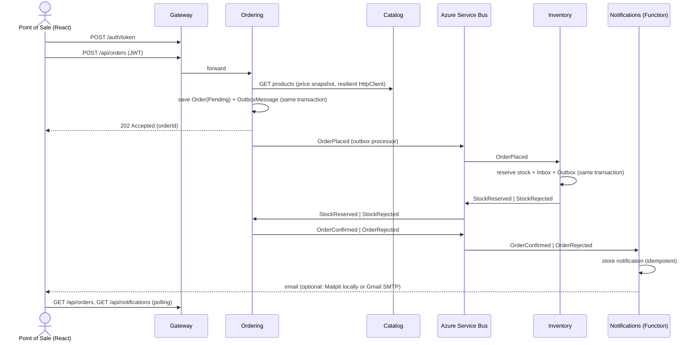

# Implementation Plan — microservices-demo

> A B2B beer ordering platform (inspired by the BEES model) built as a small but production-minded
> .NET microservices system. Scope is intentionally an **MVP deliverable in ~2 days**.

## 1. Goals

- Demonstrate, with working code, every requirement of a **Senior Backend Developer (.NET)** role:
  .NET/C#, microservices, REST APIs, PostgreSQL + EF Core, messaging (Azure Service Bus),
  Azure Functions, Docker, CI/CD, unit/integration testing, design patterns, Clean Code and AI-assisted development.
- Keep the system **small enough to explain in 10 minutes** and **run with a single command**.
- Make architectural decisions **explicit and traceable** (ADRs, patterns table, requirements map).

### Non-goals (documented as "next steps")

Kubernetes/Helm/KEDA, SonarQube, Datadog exporter, orchestrated Saga, analytics/ML, real email delivery,
a production identity provider, frontend tests.

## 2. Business flow

A point of sale (bar/market) browses the catalog, places an order, the stock is reserved,
the order is confirmed or rejected, and a notification is recorded, shown in a panel and
(optionally) sent by email.

Catalog data is **fictional** (e.g. "Golden Lager 350ml", "Amber Ale 600ml"), with a single
tongue-in-cheek nod to a famous cartoon beer: **"Duff-Style Classic Lager"**.



## 3. Architecture

```
React (Vite) ──► Gateway (YARP + JWT) ──┬─► Catalog API    ── PostgreSQL (catalogdb)
                                        ├─► Ordering API   ── PostgreSQL (orderingdb)
                                        ├─► Inventory API  ── PostgreSQL (inventorydb)
                                        └─► Notifications  ── PostgreSQL (notificationsdb)
                                              (Azure Function)

Azure Service Bus (emulator)
  topic order-events      ─ sub: inventory      (Subject = OrderPlaced)
                          ─ sub: notifications  (Subject = OrderConfirmed | OrderRejected)
  topic inventory-events  ─ sub: ordering       (Subject = StockReserved | StockRejected)
```

### Services

| Service | Style | Responsibilities | Endpoints |
|---|---|---|---|
| **Gateway** | Minimal host | YARP reverse proxy, JWT validation, demo token issuing (`bar`, `market`, `admin`), CORS, rate limiting | `POST /auth/token`, proxies `/api/*` |
| **Catalog** | Vertical Slice | Beer products (SKU, name, style, volume, pack size, price) | `GET /api/products`, `GET /api/products/{id}`, `POST/PUT /api/products` (Admin) |
| **Ordering** | Clean Architecture + DDD | Order lifecycle, discount policies, event publishing/consuming | `POST /api/orders`, `GET /api/orders`, `GET /api/orders/{id}` |
| **Inventory** | Service layer (ADR 0008) | Stock per SKU, all-or-nothing reservation | `GET /api/stock`, `PUT /api/stock/{sku}` (Admin) |
| **Notifications** | Azure Function (isolated worker) | Consumes order outcome events, stores notifications, sends email (optional), exposes them | `GET /api/notifications` (HTTP trigger) |
| **Web** | React + Vite + TypeScript | Login, catalog, cart, orders (live status), notifications panel | — |

### Integration events (contracts in `BuildingBlocks.Contracts`)

| Event | Publisher | Consumers | Payload |
|---|---|---|---|
| `OrderPlaced` | Ordering | Inventory | orderId, customerId, items (sku, quantity) |
| `StockReserved` | Inventory | Ordering | orderId |
| `StockRejected` | Inventory | Ordering | orderId, reason, missing SKUs |
| `OrderConfirmed` | Ordering | Notifications | orderId, customerId, customerEmail, total |
| `OrderRejected` | Ordering | Notifications | orderId, customerId, customerEmail, reason |

Every message carries `MessageId` (idempotency), `CorrelationId` (= orderId, tracing) and `Subject` (= event type, used for subscription filters).

## 4. Design patterns — where and why

### Architectural

| Pattern | Where | Why |
|---|---|---|
| Microservices + Database per Service | Catalog, Ordering, Inventory, Notifications | Independent deployment and data ownership |
| API Gateway | `src/Gateway` | Single entry point, centralized auth and cross-cutting concerns |
| Clean Architecture | `src/Services/Ordering` | Richest domain; dependencies point inward |
| Vertical Slice Architecture | `src/Services/Catalog` | CRUD-like service; less ceremony |
| Service layer (controller → service interface → implementation) | `src/Services/Inventory`: `StockController` → `IStockService` → `StockService` | The most common style in existing .NET services; the HTTP API and the `OrderPlaced` consumer share one owner of stock (ADR 0008) |
| Minimal APIs + MVC controllers | Minimal APIs in Catalog and the Gateway, controllers in Ordering and Inventory (ADR 0007) | Both ASP.NET Core styles behind one error/validation contract (`BuildingBlocks.Web`) |
| CQRS (lightweight) | `Ordering.Application` commands/queries | Writes go through the aggregate; reads use `AsNoTracking` projections |
| Publish/Subscribe (event-driven) | Service Bus topics | Temporal and spatial decoupling |
| Choreography Saga + Compensation | Order flow | Eventual consistency without distributed transactions |
| Transactional Outbox | `BuildingBlocks.Messaging` used by Ordering and Inventory | Atomic "save state + publish event" |
| Idempotent Consumer (Inbox) | Inventory, Ordering consumers, Notifications | Service Bus delivers at-least-once |
| Dead-Letter Queue | Service Bus subscriptions (max delivery count) | Poison messages do not block processing |
| Retry + Circuit Breaker + Timeout (Polly) | Ordering → Catalog `HttpClient`: explicit Polly v8 pipeline (`AddResilienceHandler("catalog", ...)` with `AddRetry` — exponential backoff + jitter, `AddCircuitBreaker`, `AddTimeout`) | Transient fault tolerance; fail fast when Catalog is down instead of piling up requests |
| Health Check | All services (`/health`, `/alive` via ServiceDefaults) | Operability |
| Token-based authentication (zero trust) | Gateway issues, **every service validates** | The Gateway is a convenience, not the security boundary: being on the internal network is not a credential |
| Token relay (on-behalf-of) | Ordering → Catalog (`AccessTokenPropagationHandler`) | The downstream call carries the point of sale's identity instead of a shared service account |
| Rate Limiting | Gateway (`api`, `auth` fixed windows partitioned per caller) | One noisy client cannot spend everybody else's budget; `/auth/token` is the one endpoint worth guessing at |
| Client-side polling | `src/Web` (`usePolledResource`) | Placing an order answers 202 and the outcome arrives later through the bus: the UI asks until the status is terminal instead of pretending the acknowledgement was a result |

### Domain-Driven Design (Ordering)

| Pattern | Where |
|---|---|
| Aggregate Root | `Order` (owns `OrderItem`s) |
| Value Object | `Money`, `Sku`, `Quantity` |
| Domain Events | `OrderPlacedDomainEvent`, `OrderConfirmedDomainEvent`, `OrderRejectedDomainEvent` → mapped to outbox messages |
| Factory Method | `Order.Place(...)` enforces invariants at creation |
| State Machine (guarded transitions) | `Pending → Confirmed | Rejected`; invalid transitions return domain errors |
| Guard Clauses | Aggregate and value object constructors |

### Design (GoF and others)

| Pattern | Where |
|---|---|
| Repository + Unit of Work | `IOrderRepository`, `OrderingDbContext` as UoW (Catalog/Inventory use `DbContext` directly — see ADR) |
| Strategy | `IDiscountPolicy`: `VolumeDiscountPolicy`, `NoDiscountPolicy` |
| Decorator | `ValidationDecorator<TCommand>`, `LoggingDecorator<TCommand>` around command handlers |
| Adapter | `IEventBus` → `AzureServiceBusEventBus`; `IEmailSender` → `SmtpEmailSender` (MailKit) |
| Null Object | `NoOpEmailSender` when `Email:Enabled = false` — no `if` checks spread through the code |
| Result Pattern | `Result` / `Result<T>` + `Error`, mapped to RFC 9457 `ProblemDetails` |
| Object Mapping (Mapperly) | Ordering and Inventory: source-generated `OrderMapper` / `StockMapper` (`ToResponse()` in memory, `ProjectToResponse()` for EF reads). **Catalog maps by hand on purpose** (expression projection + `FromProduct`) to show both approaches side by side |
| Options Pattern | `PricingOptions` (currency + discount tiers), `CatalogClientOptions`, `OutboxOptions`, `JwtOptions` |
| Dependency Injection | Everywhere |
| Test Data Builder | `OrderBuilder` in tests |

## 5. Tech stack

| Area | Choice |
|---|---|
| Runtime | .NET 10 (LTS), C# 14 |
| Local orchestration | .NET Aspire (AppHost + ServiceDefaults) |
| APIs | ASP.NET Core Minimal APIs (Catalog, Gateway) and MVC controllers (Ordering, Inventory), OpenAPI + Scalar, ProblemDetails |
| Validation | FluentValidation |
| Mapping | Mapperly (MIT, source generator; replaced Mapster in phase 11, ADR 0006): one `static partial` mapper per area, `IQueryable` projections from the same configuration, `RequiredMappingStrategy.Target` + warnings as errors so an unmapped member fails the build. Catalog stays manual as the reference |
| Persistence | PostgreSQL, EF Core 10 (Npgsql), migrations |
| Messaging | Azure Service Bus emulator, `Azure.Messaging.ServiceBus` SDK |
| Serverless | Azure Functions v4, isolated worker |
| Gateway | YARP (routes, clusters and per-route policies from configuration; destinations are Aspire service discovery names) |
| Email | MailKit (SMTP); Mailpit container locally, Gmail SMTP optional |
| Auth | JWT Bearer (HS256 symmetric key, demo accounts). The Gateway issues, every service validates; endpoints are authenticated by default |
| API protection | ASP.NET Core rate limiting (fixed window per caller) and CORS restricted to the configured web origins |
| Resilience | **Polly v8** through `Microsoft.Extensions.Http.Resilience`. ServiceDefaults keeps the standard handler for generic clients; the Catalog client replaces it (`RemoveAllResilienceHandlers()`) with an explicit Polly pipeline so handlers are never stacked. |
| Observability | OpenTelemetry (traces, metrics, logs) → Aspire dashboard |
| Tests | xUnit, NSubstitute, Shouldly, Testcontainers (PostgreSQL), `WebApplicationFactory`, NetArchTest |
| Frontend | React, Vite, TypeScript, plain CSS |
| Containers | Multi-stage Dockerfiles, docker-compose |
| CI | GitHub Actions |
| Build hygiene | `global.json`, `Directory.Build.props`, Central Package Management, `.editorconfig`, nullable + warnings as errors |

## 6. Repository layout

```
microservices-demo/
├─ src/
│  ├─ AppHost/                      Aspire orchestration
│  ├─ ServiceDefaults/              OpenTelemetry, health checks, resilience, service discovery
│  ├─ BuildingBlocks/
│  │  ├─ BuildingBlocks.Common/     Result, Error, guard helpers
│  │  ├─ BuildingBlocks.Contracts/  Integration events
│  │  ├─ BuildingBlocks.Messaging/  IEventBus, Service Bus adapter, Outbox, Inbox, consumer host
│  │  └─ BuildingBlocks.Web/        Result → ProblemDetails, validation filter, endpoint discovery
│  ├─ Gateway/
│  ├─ Services/
│  │  ├─ Catalog/Catalog.Api/
│  │  ├─ Ordering/Ordering.Domain | Ordering.Application | Ordering.Infrastructure | Ordering.Api
│  │  └─ Inventory/Inventory.Api/
│  ├─ Functions/Notifications/
│  └─ Web/                          React app
├─ tests/
│  ├─ Ordering.Domain.UnitTests/
│  ├─ Ordering.Application.UnitTests/
│  ├─ Inventory.UnitTests/
│  ├─ Notifications.UnitTests/
│  ├─ Ordering.IntegrationTests/
│  ├─ Inventory.IntegrationTests/
│  ├─ Gateway.Tests/
│  └─ Architecture.Tests/
├─ docs/
│  ├─ implementation-plan.md
│  ├─ postman/                      One collection per service (with tests) + local environment
│  ├─ job-requirements.md
│  ├─ ai-workflow.md
│  └─ adr/
├─ .github/workflows/ci.yml
├─ docker-compose.yml
├─ CLAUDE.md
├─ README.md
└─ README_pt.md                     (last step)
```

### Configuration and secrets

No secret is ever committed. Settings are read through the Options pattern from:

- **Aspire (local):** AppHost parameters backed by .NET user-secrets (`dotnet user-secrets set ...`).
- **docker-compose / CI:** environment variables from a git-ignored `.env` file; `.env.example` is committed.

Email settings:

| Variable | Default | Description |
|---|---|---|
| `Email__Enabled` | `true` | `false` registers `NoOpEmailSender` |
| `Email__Host` | `localhost` (Mailpit) | `smtp.gmail.com` for Gmail |
| `Email__Port` | `1025` (Mailpit) | `587` (STARTTLS) for Gmail |
| `Email__Username` / `Email__Password` | empty | Gmail address + **App Password** (requires 2FA) |
| `Email__From` | `no-reply@microservices-demo.local` | Sender address |
| `Email__FromDisplayName` | `Beer Ordering Demo` | Display name shown next to the sender address |
| `DemoUsers__bar__Email` | `bar@example.com` | The e-mail claim of the `bar` account, and therefore the recipient of its order e-mails; set to a real inbox to receive them |

By default emails are captured by **Mailpit** (web UI on `http://localhost:8025`), so the project runs
for anyone who clones it without credentials.

## 7. Testing strategy

| Level | Project | What |
|---|---|---|
| Unit | `Ordering.Domain.UnitTests` | Aggregate invariants, state transitions, discount strategies, value objects |
| Unit | `Ordering.Application.UnitTests` | Place-order handler (Catalog snapshot, unknown SKU, Catalog down), validation decorator, mapper values (in memory and projection) |
| Unit | `Inventory.UnitTests` | All-or-nothing reservation rules, mapper values, `StockController` with `IStockService` mocked (NSubstitute) |
| Unit | `Notifications.UnitTests` | Notification text built from an order outcome, e-mail status transitions, Null Object vs SMTP sender chosen by configuration |
| Integration | `Ordering.IntegrationTests` | API + EF Core against real PostgreSQL (Testcontainers); asserts order and outbox row are written atomically; enums written as strings on the raw body; token validation (401 without, with a foreign key, without claims); `IEventBus` faked |
| Integration | `Inventory.IntegrationTests` | Written before the phase 13 refactor to pin the contract: `GET /api/stock` with and without `?sku=` (normalized, sorted, `quantityOnHand`), 400 over 100 SKUs, `PUT` 200 (reserved packs kept) / 400 / 404 with `code` / 401 / 403, and the registered `OrderPlaced` handler reserving all or nothing and staging `StockReserved` / `StockRejected` in the outbox; `IEventBus` faked |
| Functional | `Gateway.Tests` | The real Gateway in memory (`WebApplicationFactory`, no backend): token issuing and its failure modes, 401 before proxying, 403 for the wrong role, CORS preflight allowed and refused |
| Architecture | `Architecture.Tests` | Domain has no dependency on Application/Infrastructure or frameworks; Application has no dependency on Infrastructure, EF Core, ASP.NET Core, Service Bus or HTTP; command handlers are internal and sealed; controllers do not use Infrastructure |

Principle: fast tests on business rules, real infrastructure where mocks would lie (database), coverage as a signal, not a goal.

## 8. CI (GitHub Actions)

`ci.yml`, triggered on push and pull request to `main`:

1. **backend** — setup .NET 10 → restore → build (warnings as errors) → unit + architecture tests → integration tests (Testcontainers on the Ubuntu runner) → publish test results.
2. **frontend** — `npm ci` → lint → build.
3. **docker** (needs backend + frontend) — build every image (no push).

## 9. Phases and checkpoints

Work proceeds phase by phase, **one working session per phase** (see [Working sessions](#working-sessions)).
**At the end of each phase: explain what was built and why, wait for approval, then commit** (Conventional Commits),
push, and update the **Status** column and the phase notes below.

| # | Phase | Status | Deliverables | Suggested commits |
|---|---|---|---|---|
| 0 | Plan & repo foundation | ✅ Done | This plan, `global.json`, `Directory.Build.props`, `Directory.Packages.props`, `.editorconfig`, solution (`.slnx`), `CLAUDE.md` | `docs: add implementation plan`, `build: add solution and shared build configuration` |
| 1 | Aspire & building blocks | ✅ Done | AppHost (PostgreSQL, Service Bus emulator with topics/subscriptions), ServiceDefaults, `Result`, contracts, `IEventBus`, Outbox/Inbox + processor, Service Bus smoke test tool | `feat(building-blocks): ...`, `feat(apphost): ...`, `chore(tools): ...` |
| 2 | Catalog | ✅ Done | Entity, EF configuration, migration, seed (fictional brands + "Duff-Style Classic Lager"), endpoints, validation, ProblemDetails mapping for `Result` | `feat(catalog): ...` |
| 3 | Ordering domain | ✅ Done | Aggregate, value objects, domain events, discount strategies + unit tests | `feat(ordering): add order aggregate`, `test(ordering): ...` |
| 4 | Ordering application & API | ✅ Done | Commands/queries, decorators, repository, EF, outbox, Catalog client with Polly pipeline, consumers, Mapster read mappings (aggregate → DTO only), integration test, architecture tests | `feat(ordering): ...`, `test: ...` |
| 5 | Inventory & end-to-end flow | ✅ Done | Stock model, reservation consumer (inbox + outbox, optimistic concurrency), endpoints with Mapster projections, unit tests; full flow verified in Aspire | `feat(inventory): ...` |
| 6 | Gateway & auth | ✅ Done | YARP routes, `/auth/token`, JWT validation in gateway and services, CORS | `feat(gateway): ...` |
| 7 | Notifications | ✅ Done | Function with Service Bus trigger, idempotent storage, email sender (Mailpit/Gmail, toggleable), HTTP trigger for the panel | `feat(notifications): ...` |
| 8 | Web | ✅ Done | Login, catalog, cart, orders with live status, notifications panel | `feat(web): ...` |
| 9 | Containers & CI | ✅ Done | Dockerfiles, `docker-compose.yml`, GitHub Actions workflow green | `build(docker): ...`, `ci: ...` |
| 10 | Documentation | ✅ Done | `README.md` (patterns, how to run, demo script), `job-requirements.md`, ADRs, `ai-workflow.md`, then `README_pt.md` | `docs: ...` |
| 11 | Mapperly | ✅ Done | Mapster replaced by Mapperly in Ordering and Inventory (mappers + projections), tests, ADR 0006 superseding 0005; project-level dotnet agent skills | `refactor(ordering,inventory): replace mapster with mapperly` |
| 12 | Controllers | ✅ Done | Inventory and Ordering move to MVC controllers (Catalog and Gateway stay on minimal APIs), MVC ProblemDetails + validation filter in `BuildingBlocks.Web`, ADR 0007; HTTP contract unchanged | `feat(building-blocks): ...`, `refactor(inventory): ...`, `refactor(ordering): ...` |
| 13 | Service layer | ✅ Done | Inventory moves from vertical slices to a classic layered service: `StockController` → `IStockService` → `StockService`, shared by the HTTP API and the `OrderPlaced` consumer; controller unit tests with NSubstitute; `Inventory.IntegrationTests` (Testcontainers) pinning the HTTP contract; ADR 0008 (amends 0002). HTTP and messaging contracts unchanged | `test(inventory): ...`, `refactor(inventory): ...`, `docs: ...` |
| 14 | Real Azure Service Bus | ✅ Done | Broker switchable between the emulator and a real namespace at the infrastructure edge only: `AddMessaging()` + `Messaging:Broker` + `https-azure` launch profile (Aspire provisions the namespace, Entra ID), compose `emulator` profile + `SERVICEBUS_CONNECTION` (send/listen SAS), smoke tool with `SERVICEBUS_NAMESPACE`, ADR 0009; service code unchanged | `feat(apphost): ...`, `build(docker): ...`, `chore(tools): ...`, `docs: ...` |

### Phase notes

Decisions and facts discovered during implementation that the next phases depend on.

- **Phase 1**
  - Service Bus is consumed through `builder.AddServiceBusMessaging()`, `services.AddOutbox<TDbContext>()`, `services.AddIntegrationEventHandler<TEvent, THandler>()` and `services.AddServiceBusSubscription<TDbContext>(Topology.Subscriptions.X)`.
  - Each service `DbContext` must call `modelBuilder.AddMessagingTables()` (outbox/inbox, snake_case table and column names).
  - Integration event handlers must **not** call `SaveChangesAsync`; the consumer pipeline saves business change + inbox record atomically.
  - Emulator AMQP port is fixed to `5672`; `tools/servicebus-smoke.cs` sends/peeks/receives against it.
  - Database resource names in the AppHost: `catalogdb`, `orderingdb`, `inventorydb`, `notificationsdb`.
  - `ServiceDefaults` adds `AddStandardResilienceHandler()` to every `HttpClient`; clients with a custom Polly pipeline must call `RemoveAllResilienceHandlers()` first.
- **Phase 2**
  - `BuildingBlocks.Web` (new) is shared by every HTTP service: `AddApiProblemDetails()` + `UseApiExceptionHandling()` (all errors are RFC 9457 with `traceId`; binding errors stay 4xx), `Result.ToProblem()` (`Validation→400`, `NotFound→404`, `Conflict→409`, otherwise 500, plus a `code` extension), `.WithRequestValidation<TRequest>()` (FluentValidation endpoint filter → 400 `ValidationProblem`) and `IEndpoint` + `AddEndpoints(assembly)`/`MapEndpoints()`.
  - Vertical slice layout: `Features/<Area>/<Feature>/` with `Endpoint`, `Request`, `Handler`, `Validator`; handlers are registered explicitly in `CatalogFeatures`. Handlers return `Result<T>`; endpoints return typed `Results<...>` so OpenAPI documents every response.
  - Catalog runs as Aspire resource **`catalog`** → Ordering must use `https+http://catalog`.
  - `GET /api/products?sku=A&sku=B` returns only those SKUs (max 100, case-insensitive) — Ordering uses it to snapshot prices in one call. Response: `id, sku, name, style, volumeMl, packSize, price` (price per pack, `numeric(10,2)`; enums serialized as strings).
  - The SKU (uppercase, e.g. `GOLDEN-LAGER-350`) is the cross-service identity and is immutable (not in the PUT body). Inventory must seed stock for the 8 SKUs in `CatalogSeeder`.
  - Migrations are applied at startup and seeding uses EF Core `UseSeeding`/`UseAsyncSeeding` (only into an empty table). A design-time factory lets `dotnet ef migrations add` run without Aspire: `dotnet ef migrations add <Name> --project src/Services/Catalog/Catalog.Api --output-dir Persistence/Migrations`.
  - `POST`/`PUT` are anonymous until phase 6 (`TODO(phase 6)` marks where the Admin policy goes).
- **Phase 3**
  - `Ordering.Domain` references only `BuildingBlocks.Common` (dependency-free `Result`/`Error`). Architecture tests must allow it and forbid Application, Infrastructure, EF Core and ASP.NET Core.
  - Entry points: `Order.Place(customerId, customerEmail, lines, discountPolicy, placedOnUtc)`, `order.Confirm(utcNow)`, `order.Reject(reason, utcNow)`. Time is passed in (the application layer uses `TimeProvider`); the domain never reads the clock.
  - Guard clauses throw for programming errors (blank customer id/email or rejection reason, null lines, a discount policy returning more than the subtotal or another currency). Business rules return `Result` errors: `Orders.NoItems`, `Orders.TooManyItems` (max 50 lines), `Orders.DuplicateSku`, `Orders.MixedCurrencies` (all `Validation`) and `Orders.InvalidStatusTransition` (`Conflict`). Only `Pending` can move, to `Confirmed` or `Rejected`; both are terminal and set `CompletedOnUtc`.
  - Value objects are `sealed record`s with private constructors and `Create(...) → Result<T>`: `Money` (non-negative, max 2 decimals, upper-case ISO 4217 code; cross-currency arithmetic throws), `Sku` (trimmed, upper-case, same format and max length 50 as Catalog), `Quantity` (1–1000 packs). Phase 4 maps them as EF Core complex types/value conversions and uses the private parameterless constructors of `Order`/`OrderItem` (items live in the `_items` backing field; `OrderItem.LineTotal` is computed, not stored).
  - Catalog prices have no currency: the application layer picks the currency (configuration) when it builds `OrderLine`s from the Catalog price snapshot.
  - Aggregates collect events in `DomainEvents`; persistence must translate them to integration events in the outbox and then call `ClearDomainEvents()`. Mapping is 1:1 (`OrderPlacedDomainEvent → OrderPlaced`, `OrderConfirmedDomainEvent → OrderConfirmed`, `OrderRejectedDomainEvent → OrderRejected`); reuse `IDomainEvent.EventId` as the integration event `EventId` so a retried save cannot produce a second message.
  - Discounts use the Strategy pattern: `IDiscountPolicy.CalculateDiscount(subtotal, totalQuantity)`, implemented by `VolumeDiscountPolicy(tiers)` (highest reached tier wins; rates in (0, 0.5]; invalid tiers throw at construction) and `NoDiscountPolicy.Instance` (Null Object). Phase 4 binds `DiscountOptions` to the tiers and registers the policy.
  - Tests: `tests/Ordering.Domain.UnitTests` with xUnit v3 (VSTest runner, test projects are `OutputType=Exe`), Shouldly, NSubstitute and coverlet; `Builders/OrderBuilder` is the Test Data Builder.
- **Phase 4**
  - Projects: `Ordering.Application` (references Domain only + FluentValidation, Mapster, logging/options abstractions), `Ordering.Infrastructure` (EF Core, outbox/inbox, Catalog client, consumers, query handlers), `Ordering.Api` (endpoints + composition root). Aspire resource **`ordering`** (`http://localhost:5102`); it references `orderingdb`, `messaging` and `catalog` but does not `WaitFor` Catalog (the resilience pipeline covers it).
  - Building blocks changed: `ErrorType.Unavailable` → **503**; `ValidationError` (field → messages) → 400 with the same `errors` shape as the validation filter; `DbContext.AddToOutbox(...)` for code that cannot resolve `IOutbox`; the outbox processor runs its transaction inside `CreateExecutionStrategy()` (Aspire's Npgsql retry strategy rejects user transactions otherwise); `Messaging:Consumers:Enabled=false` stops subscription processors (integration tests).
  - CQRS: commands go through `ICommandHandler<TCommand, TResponse>` registered with `AddCommandHandler<...>()` and wrapped **logging → validation → handler** (hand-written decorators, no MediatR/Scrutor). Queries implement `IQueryHandler<,>` **in Infrastructure** (`AsNoTracking` + `ProjectToType`), so the read side never loads aggregates.
  - `PlaceOrderCommand` commits through `IUnitOfWork`. `ConfirmOrderCommand` / `RejectOrderCommand` do **not** commit: they run inside the consumer pipeline, which saves the change, the outcome outbox row and the inbox record together. Consumers (`StockReserved/StockRejectedIntegrationEventHandler`) complete a `Conflict` (order no longer Pending) and throw anything else (e.g. unknown order → retries → DLQ).
  - Domain events → outbox: `DomainEventsToOutboxInterceptor` (stateless `SaveChangesInterceptor`, added in `AddNpgsqlDbContext`) maps them with `IntegrationEventMapper` (manual, domain `EventId` reused) and `CorrelationId = orderId`. Inventory should follow the same idea (outbox row in the same `SaveChanges`).
  - Persistence: tables `orders`, `order_items`, `outbox_messages`, `inbox_messages`. `Money`, `Sku` and `Quantity` are EF **complex types** (not value converters) so projections such as `Sku.Value` translate to SQL; `LineTotal` is not stored; `xmin` is the optimistic concurrency token. Migrations: `dotnet ef migrations add <Name> --project src/Services/Ordering/Ordering.Infrastructure --startup-project src/Services/Ordering/Ordering.Infrastructure --output-dir Persistence/Migrations`.
  - Catalog client: typed `HttpClient` at `https+http://catalog`, `RemoveAllResilienceHandlers()` (experimental `EXTEXP0001`, suppressed locally) then `AddResilienceHandler("catalog")`: total timeout 10 s → retry ×3 exponential + jitter → circuit breaker (50 % over 30 s, min 5 calls, open 15 s) → attempt timeout 2 s (section `Catalog`). What survives the pipeline becomes `Catalog.Unavailable` (503). Verified live: first call ~9 s of retries, then fail-fast in ~10 ms while open.
  - Mapster: `DependencyInjection.CreateMappingConfig()` is strict (`RequireExplicitMapping`, `RequireDestinationMemberSource`); `OrderMappingRegister` maps `Order → OrderResponse | OrderSummaryResponse`, `OrderItem → OrderItemResponse` with plain expressions (items ordered by SKU, line total rounded to cents) so the same config serves `Map` and `ProjectToType`; unit tests call `Compile()` and `CompileProjection()`.
  - API: `POST /api/orders` → **202** + `Location` + `OrderResponse` (Pending); `GET /api/orders` (summaries, newest first, max 100); `GET /api/orders/{id}` (404 for another customer's order). Enums serialized as strings. Pricing: section `Pricing` (`Currency` USD, tiers 20 packs → 5 %, 50 → 10 %).
  - Customer identity is temporary: `CurrentCustomer` binds `X-Customer-Id` / `X-Customer-Email`, falling back to `DemoUsers:PointOfSale` (`bar`, `bar@example.com`). `TODO(phase 6)` replaces it with JWT claims.
  - Tests: `Ordering.Application.UnitTests` (new, 18), `Ordering.IntegrationTests` (11, `WebApplicationFactory` + Testcontainers `postgres:17-alpine`, fakes for `IEventBus` and `ICatalogClient`), `Architecture.Tests` (7, NetArchTest). Full flow checked against Aspire: `OrderPlaced` reaches `order-events/inventory`; `StockReserved`/`StockRejected` sent twice with the same `MessageId` produce one transition, one outcome event and one inbox row.
- **Phase 5**
  - One project, `Inventory.Api` (Vertical Slice), Aspire resource **`inventory`** (`http://localhost:5103`); it references `inventorydb` and `messaging` only — nothing calls it synchronously, orders reach it through the topic.
  - Domain (public, so unit tests reach it): `StockItem` (packs, `QuantityAvailable` / `QuantityReserved`, `Reserve`, `SetQuantityAvailable`, `NormalizeSku`) and the pure function `StockReservation.Reserve(stockItems, lines, utcNow) → ReservationOutcome`. **All-or-nothing:** every line is checked before anything is reserved; the outcome carries the reason (`UnknownSkuReason`, `InsufficientStockReason` or both) and the sorted list of SKUs that blocked it. Repeated SKUs are added up; guard clauses throw for a reservation with no lines or a non-positive quantity (a malformed message is retried and dead-lettered).
  - A rejection is a normal business outcome (it becomes an event), so it is a `ReservationOutcome`, not a `Result` failure. `Result` is still used for the HTTP slices.
  - `OrderPlacedIntegrationEventHandler` loads the SKUs **tracked**, reserves and stages `StockReserved` / `StockRejected` through `IOutbox` with `CorrelationId = orderId`. It never calls `SaveChangesAsync`: the consumer pipeline commits stock + outbox + inbox in one transaction.
  - Persistence: tables `stock_items`, `outbox_messages`, `inbox_messages`; unique index on `sku`, check constraint `quantity_available >= 0 AND quantity_reserved >= 0`, `xmin` as the optimistic concurrency token (a lost update makes the save fail → message abandoned → retried against fresh quantities). Migrations: `dotnet ef migrations add <Name> --project src/Services/Inventory/Inventory.Api --output-dir Persistence/Migrations`.
  - `InventorySeeder` repeats the 8 SKUs of `CatalogSeeder` (Inventory must not reference Catalog); `MIDNIGHT-STOUT-500` starts with only 5 packs so the demo can show a rejected order.
  - API: `GET /api/stock` (all rows or `?sku=A&sku=B`, max 100, sorted by SKU, `ProjectToType<StockResponse>()`), `PUT /api/stock/{sku}` (sets the available quantity; reserved packs are untouched; **404** for a SKU with no stock row, so a typo cannot invent a product). `TODO(phase 6)` marks the Admin policy. `StockResponse` exposes `quantityOnHand = available + reserved`, computed in SQL.
  - Mapster: `InventoryMapping.CreateMappingConfig()` (strict) + `StockMappingRegister`; unit tests call `Compile()` and `CompileProjection()`.
  - Reserved packs are never released (there is no order cancellation and no shipping step), which is why a separate reservation table is not needed yet. Releasing on `OrderRejected` and committing on shipment is the natural next step.
  - Tests: `Inventory.UnitTests` (18). Full flow checked against Aspire: order within stock → `Confirmed` in ~3.5 s with 100 → 98 available / 0 → 2 reserved; order with 1000 packs of the short SKU → `Rejected` with reason `Not enough stock for some products. (MIDNIGHT-STOUT-500)` and **nothing** reserved for its available line; the same `OrderPlaced` sent twice with one `MessageId` produced one reservation, one inbox row and one `StockReserved`.
- **Phase 6**
  - One project, `src/Gateway` (`Gateway.csproj`), Aspire resource **`gateway`** (`http://localhost:5100`, `WithExternalHttpEndpoints`). It references `catalog`, `ordering` and `inventory` for service discovery and owns nothing else: no database, no messaging.
  - `BuildingBlocks.Web` gained the authentication half everyone shares: `JwtOptions` (section `Jwt`: `SigningKey`, `Issuer` `microservices-demo`, `Audience` `microservices-demo-api`, `Lifetime`, `ClockSkew`; data-annotation validated with `ValidateOnStart`), `AddJwtAuthentication()`, `JwtClaimNames` (`sub`, `email`, `role`, `name`), `Roles` (`PointOfSale`, `Admin`), `AuthorizationPolicies.Admin`, `RequireAdmin()` and `AddBearerSecurityScheme()` for the OpenAPI document. `ErrorType.Unauthorized` → **401** was added to `BuildingBlocks.Common`.
  - **Secure by default:** `AddJwtAuthentication()` sets a *fallback* authorization policy (`RequireAuthenticatedUser`), so a new endpoint is protected unless it says `AllowAnonymous`. The exceptions are health probes (`MapDefaultEndpoints`, an orchestrator has no token) and `MapOpenApi`/`MapScalarApiReference`. `MapInboundClaims = false`: claims keep the names the token uses.
  - **Every service validates the token itself** (`Catalog`, `Ordering`, `Inventory` all call `AddJwtAuthentication()` + `UseAuthentication/UseAuthorization`). Being inside the cluster is not a credential; the Gateway is a convenience, not the security boundary.
  - `POST /auth/token` (Gateway only) exchanges demo credentials for an HS256 JWT signed by `DemoTokenIssuer` — the single place in the solution that *creates* a token. Wrong password and unknown user return the same `Auth.InvalidCredentials` 401 (no account enumeration) and the password comparison is constant time. Accounts live in section `DemoUsers` (`bar`, `market` → `PointOfSale`; `admin` → `Admin`; password `demo`): **demo credentials on purpose, not secrets**, so the repository runs for anyone who clones it. A production system swaps this endpoint for an identity provider and keeps only the validation half.
  - The **signing key is a real secret**: AppHost parameter `jwt-signing-key` (`GenerateParameterDefault`, `secret: true`, `persist: true`) generated on first run into the AppHost user-secrets and injected into all four projects as `Jwt__SigningKey`. docker-compose (phase 9) reads it from `.env` (`JWT_SIGNING_KEY`).
  - YARP routes and clusters are configuration (`ReverseProxy` section), destinations are service discovery names (`https+http://catalog`) resolved by `AddServiceDiscoveryDestinationResolver()`. Routes are split by method so the policy is part of the route: `catalog-read`/`inventory-read`/`ordering` use `default` (authenticated), `catalog-admin` (`POST`,`PUT /api/products`) and `inventory-admin` (`PUT /api/stock`) use `Admin`. `/api/notifications` is added in phase 7.
  - Middleware order in the Gateway: exception handling → **CORS** → authentication → authorization → rate limiter → endpoints → `MapReverseProxy`. CORS runs first so a browser preflight is answered before authorization can reject it for having no token. Allowed origins come from section `Cors` (never `*`); `Location` is exposed for the 202 of *place order*.
  - Rate limiting: fixed window partitioned by `sub` (or remote IP when anonymous). Policy `api` (100 / 10 s) on the proxied routes, `auth` (10 / min) on `/auth/token`. Rejections are 429 and `UseStatusCodePages` turns them into ProblemDetails like everything else.
  - **Ordering identity now comes from the token:** `CurrentCustomer` binds `sub`/`email` (the `X-Customer-*` headers and `DemoCustomerOptions` are gone) and throws `BadHttpRequestException(401)` for a token that validates but identifies nobody.
  - **Service-to-service calls relay the caller's token** (`IAccessTokenProvider` port in `Ordering.Application`, `HttpContextAccessTokenProvider` in `Ordering.Api`, `AccessTokenPropagationHandler` in `Ordering.Infrastructure`, outside the Polly pipeline). The port keeps ASP.NET Core out of the inner layers. Client credentials for machine-to-machine calls is the natural next step; here Ordering genuinely acts *on behalf of* the point of sale. A 401/403 from Catalog is logged apart from a transient fault so a bad key is not mistaken for an outage.
  - Tests: `Gateway.Tests` (new, 12 — token issuing, bad credentials, 401 before proxying, 403 for the wrong role, CORS preflight allowed and refused) and `Ordering.IntegrationTests` (+4 authentication tests, `TestTokens` signs them without involving the Gateway). Verified live in Aspire end to end through the Gateway: sign in → place order → `Confirmed` with stock moved, `market` gets 404 for `bar`'s order, `PointOfSale` gets 403 on `PUT /api/stock`, `/auth/token` answers 429 after 10 calls. All four Postman collections pass with newman (145 assertions).
- **Phase 7**
  - One project, `src/Functions/Notifications` (`Notifications.csproj`), Aspire resource **`notifications`** (`http://localhost:5104`); it references `notificationsdb` and `messaging`. **.NET 10 isolated worker works** (Worker 2.52, Core Tools 4.14, Functions runtime 4.1052) — the .NET 8 fallback in the risk table was not needed.
  - Two triggers: a **Service Bus trigger** on `order-events/notifications` (`OrderConfirmed`, `OrderRejected`) and an **HTTP trigger** `GET /api/notifications`. The Functions host maps HTTP triggers under the `api` prefix, so the route matches the other services without a rewrite.
  - The Functions host owns the receive loop, so Notifications does **not** call `AddServiceBusMessaging()` and has no `IEventBus` and no outbox: it is the end of the choreography. What it reuses from the building blocks is what crosses the boundary anyway — `BuildingBlocks.Contracts`, `IntegrationEventSerializer` (made **public** for this) and the inbox table. `AddMessagingTables()` was split into `AddOutboxTable()` / `AddInboxTable()` so a pure consumer does not get an unused table.
  - **Idempotency is written out by hand** because the shared consumer pipeline is not in play: notification + `InboxMessage(MessageId, "notifications")` are saved in one `SaveChangesAsync`, a unique violation is treated as a concurrent redelivery, and an unknown `Subject` is logged and completed. `host.json` keeps `autoCompleteMessages`, so throwing abandons the message and the subscription's max delivery count dead-letters it. Verified: the same `OrderConfirmed` sent twice with one `MessageId` produced one notification row and one e-mail.
  - **The e-mail is sent after the commit, never inside it.** An SMTP send cannot be rolled back, so the notification is the source of truth and the e-mail is a best-effort second channel whose outcome is stored on the row (`EmailStatus`: `Pending` → `Skipped` / `Sent` / `Failed`). A delivery failure is logged, not rethrown: retrying would hit the inbox row and skip, so throwing would only dead-letter an outcome that was recorded correctly.
  - `IEmailSender` returns an `EmailDelivery` instead of `Task`. The Null Object (`NoOpEmailSender`, registered when `Email:Enabled=false`) is allowed to do nothing, but it is not allowed to let the panel claim an e-mail was sent.
  - **Mailpit** (`axllent/mailpit`, container `msdemo-mailpit`) is started by the AppHost: SMTP on `1025`, inbox UI on **`http://localhost:8025`**. The AppHost injects `Email__Host` / `Email__Port` from its endpoint. Gmail needs only `Email__Host=smtp.gmail.com`, `Email__Port=587`, `Email__UseStartTls=true` and an App Password.
  - The Functions runtime needs a storage account for its own bookkeeping: AppHost resource `functions-storage` running Azurite (`msdemo-azurite`), attached with `WithHostStorage(...)`. It is infrastructure for the host, not application data.
  - **Authentication is a worker middleware.** There is no `UseAuthentication` in the Functions pipeline, so `JwtAuthenticationMiddleware` calls the same `JwtBearer` handler `AddJwtAuthentication()` registers, fails closed for every HTTP trigger (there is an explicit allow-list, empty today) and lets non-HTTP triggers through — the broker is not a user. A 401 is the usual RFC 9457 body (`Notifications.Unauthenticated`).
  - `GET /api/notifications` is scoped to the `sub` claim in the query itself (newest first, max 100): there is no endpoint that takes a customer id, so one point of sale cannot ask for another one's panel. Mapping is **by hand** (`NotificationResponse` built in the `Select`), like Catalog; enums are serialized as strings.
  - Persistence: tables `notifications`, `inbox_messages`; `type` and `email_status` are stored as text (adding a value later must not renumber old rows) and the index is `(customer_id, created_on_utc DESC)`, which is exactly the panel's query. Migrations: `dotnet ef migrations add <Name> --project src/Functions/Notifications --output-dir Persistence/Migrations`.
  - Gateway: cluster `notifications` (destination `http://notifications` — the Functions host serves plain HTTP locally) and route `notifications`, policy `default`, **GET only**, so a write method is refused by the Gateway with 405 and never reaches the Function.
  - `local.settings.json` is git-ignored and not needed: Aspire supplies `FUNCTIONS_WORKER_RUNTIME`, the storage connection and every setting. Running `func start` by hand does need one.
  - Tests: `Notifications.UnitTests` (new, 15) and `Gateway.Tests` (+1; `/api/notifications` used to be the "unknown route" example and is now a real route). Verified live in Aspire end to end: order within stock → notification `OrderConfirmed` and an e-mail in Mailpit ~3 s after placing it; order over stock → `OrderRejected` with the reason and the SKU; `market` sees an empty panel while `bar` sees its own; messages that had been waiting on the `notifications` subscription since earlier phases were drained on first start (nothing was lost while there was no consumer). All five Postman collections pass with newman (176 assertions).
- **Phase 8**
  - `src/Web` is a React 19 + Vite 8 + TypeScript app (plain CSS, no UI library), scaffolded from the official `react-ts` template: **oxlint** is the linter it ships with, so phase 9 CI runs `npm ci`, `npm run lint`, `npm run build`. Aspire resource **`web`** (`AddViteApp("web", "../Web").WithNpm()`), which installs the packages before starting the dev server.
  - The dev server port is **fixed to 5173** (`strictPort`, endpoint not proxied) because the Gateway allows a fixed list of CORS origins (`Cors:AllowedOrigins`, 5173 dev and 4173 preview); a random port would be refused by the browser, not by the code.
  - A browser cannot use service discovery, so the AppHost injects **`VITE_GATEWAY_URL`** from the gateway endpoint. Vite only exposes variables prefixed with `VITE_`, and `client.ts` falls back to `http://localhost:5100` so `npm run dev` alone still reaches a Gateway started by hand.
  - **The Gateway is the only address the app knows** (`/auth/token`, `/api/products`, `/api/stock`, `/api/orders`, `/api/notifications`, all in `api/endpoints.ts`). `api/types.ts` mirrors the service contracts; enums are string unions because every service serializes them as strings.
  - Session: the token is kept in `sessionStorage` with its expiry (`auth/session.ts`). `AuthContext` exposes a `call` function instead of the raw token, so adding the bearer header and reacting to a rejected one happen in one place: a 401 from any service (or a token this app already knows is expired) signs out. Documented trade-off: an http-only, same-site cookie would keep a script from reading the token at all, which needs the token to be issued for a browser client.
  - **No pricing rule lives in the client.** The cart shows an estimate from the catalog prices and says so; subtotal, volume discount and total come from the order the Ordering service returns, in the currency it carries.
  - The cart is client state per signed-in user in `sessionStorage`. Its reducer state carries the storage key it was restored from, so the empty initial state can never overwrite a stored cart (React mounts effects twice in development, which is exactly how that bug showed up).
  - **Live status is polling** (`usePolledResource`): 2 s while an order is `Pending` and it stops at a terminal state (`isFinal`), 10 s for catalog + stock, 5 s for notifications, and nothing at all while the tab is hidden. Placing an order answers 202 and the outcome is decided by other services over the bus, so the client has to ask; SSE or SignalR is the natural next step and is written down in the hook.
  - Errors: `client.ts` turns every RFC 9457 body into an `ApiError` (status, `code`, `errors`, `traceId`); checkout lists the field errors of a 400 and shows the single description of anything else (e.g. 503 when Catalog is unreachable). A failed `fetch` (Gateway down, CORS) becomes status 0 with a readable message.
  - Routes: `/login` (public), `/catalog`, `/cart`, `/orders`, `/orders/{id}`, `/notifications` behind `RequireAuth`, which is convenience only — the services reject an unauthenticated call regardless of what the app renders.
  - Formatting uses `Intl` with a fixed `en-US` locale, matching `InvariantGlobalization` on the backend, so the same order reads the same way on any machine.
  - Verified live in Aspire end to end: sign in as `bar` → catalog shows Catalog prices merged with Inventory availability → order within stock goes `Pending → Confirmed` on its own in ~4 s → the notification and its e-mail appear in the panel; 50 packs of `MIDNIGHT-STOUT-500` (5 available) comes back `Rejected` with the reason and the SKU, and with the 10 % volume discount the server applied (which is why the cart only estimates); `market` sees an empty order list; a wrong password shows the Gateway's 401 message; signing out clears the session and `/orders` redirects to `/login`.
- **Phase 9**
  - One multi-stage **Dockerfile per deployable, next to its project** (`Catalog.Api`, `Ordering.Api`, `Inventory.Api`, `Gateway`, `Functions/Notifications`, `Web`); the build context is always the repository root, because a service needs `global.json`, `Directory.*.props` and the shared projects. Each one copies only the `.csproj` files of its own dependency graph and restores before copying sources, so the restore layer survives most commits. Runtime images: `aspnet:10.0` as the non-root `$APP_UID`, `azure-functions/dotnet-isolated:4-dotnet-isolated10.0` for Notifications (moved to port 8080 with `ASPNETCORE_URLS` so every service listens on the same port), `nginx:1.29-alpine` serving the Vite build with an SPA fallback and immutable caching for the fingerprinted assets.
  - `.dockerignore` excludes `bin/`, `obj/` and `node_modules/` for correctness, not only size: a host `obj/project.assets.json` carries Windows paths and breaks the restore inside the image.
  - `VITE_GATEWAY_URL` is a **build argument** of the web image, not a container variable: Vite inlines it, and it is the address the browser uses (`http://localhost:5100`), not one inside the network. The web container is published on **4173**, the preview origin already in the Gateway's CORS allow-list, so compose needs no CORS override.
  - `docker-compose.yml` writes down what the AppHost does at run time: `docker/postgres/init-databases.sh` creates the four databases, `docker/servicebus/config.json` provisions the emulator topology (**kept in sync with `Topology.cs` by hand**; the emulator calls the subject `Label` in correlation filters), connection strings use the same names (`ConnectionStrings__catalogdb`, `ConnectionStrings__messaging`, ...), and service discovery uses the same `Services__<name>__http__0` configuration Aspire injects. The value must carry the scheme (`http://catalog:8080`): a bare `host:port` makes `https+http://catalog` resolve to **https** and the Gateway fails with a TLS handshake error against a plain-HTTP port.
  - A standalone **Aspire dashboard** (`aspire-dashboard:13.5.2`, UI on `http://localhost:18888`) is the OTLP endpoint in compose, so traces, metrics and logs work the same as under Aspire. Published host ports match the Aspire launch profiles (5100-5104), so `local.postman_environment.json` works against both; run one or the other, not both.
  - PostgreSQL 18 images expect the volume at `/var/lib/postgresql` (not `/data`) and refuse to start otherwise.
  - Health probes: `MapDefaultEndpoints` now maps `/health` and `/alive` in Development **or** when `HealthChecks:Expose=true`, which compose sets. There is no compose `healthcheck:` for the .NET services because the runtime images have no curl; `restart: unless-stopped` covers a service that starts before the broker. PostgreSQL is gated with `pg_isready`. The OpenAPI document and Scalar stay Development-only, so the two "OpenAPI document" requests in the Catalog collection are expected to fail against compose.
  - `.env.example` was rewritten to what compose actually reads: `POSTGRES_PASSWORD`, `SERVICEBUS_SQL_PASSWORD`, `JWT_SIGNING_KEY` (required), plus optional `EMAIL_*`, `POSTGRES_PORT` and `VITE_GATEWAY_URL`. The old `DemoUsers__PointOfSale__*` entries and the wrong audience were leftovers from before phase 6.
  - CI (`.github/workflows/ci.yml`, push/PR to `main` + manual): **backend** (SDK from `global.json`, Release build with warnings as errors, unit/architecture/Gateway tests, then Testcontainers integration tests, `.trx` uploaded as an artifact), **frontend** (`npm ci`, lint, build) and **docker** (needs both; a matrix builds the six images with Buildx and the GitHub Actions cache, no push).
  - Verified locally: Release build clean, 152 tests green (137 fast + 15 integration), web lint + build. Verified in compose end to end through the Gateway: order within stock → `Confirmed` in ~2 s with stock moved and the e-mail in Mailpit; 50 × `MIDNIGHT-STOUT-500` → `Rejected` with reason; 401 without a token, 403 for `PointOfSale` on `PUT /api/stock`, 200 for `admin`; SPA deep links served; telemetry visible in the dashboard; `/health` and `/alive` answer 200 on every service. The five Postman collections run against compose with newman: 174 of 176 assertions pass, the 2 failures being the expected Development-only OpenAPI request. Run them at least a minute apart: `/auth/token` allows 10 calls per minute.
  - **Resolved: a green run on GitHub.** The first run of the workflow (PR #1, 2026-09-18) never started a job: the GitHub account is locked by a billing issue, which blocks Actions even on a public repository. Every step the workflow runs passes locally, so what is unverified is the workflow file itself on the GitHub runners. Once the account is unlocked, re-run it (`gh run rerun <run id>` or "Re-run all jobs" on the PR) before merging, and fix anything that only shows up there. **Resolved 2026-09-19:** the lock was lifted and the first run that started (PR #3, run 35457724181) was green on the first try: backend, frontend and the six images.
- **Phase 10**
  - `README.md` is the entry point: architecture and ground rules, the order flow (sequence diagram + the five things that make it reliable), both ways to run (Aspire, docker-compose) with every URL, demo accounts, optional Gmail, the demo script (section 11 expanded with the isolation step and the optional resilience/rate-limit extras), the patterns tables with links to the code, testing, CI, layout and next steps.
  - `docs/adr/` holds the five planned ADRs plus an index (`README.md`). Format: Status, Context, Decision, Consequences, Alternatives considered; each one says when the decision should be revisited. A changed decision is superseded by a new ADR, never edited away.
  - `docs/job-requirements.md` maps every requirement of the role to the code that demonstrates it, lists related topics (resilience, security, observability) and an **honest gaps** section (no CD/cloud deployment, no load or contract tests; the pending GitHub run was also listed until it went green).
  - `docs/ai-workflow.md` describes the process: plan first, `CLAUDE.md` conventions backed by mechanical checks, one session per phase with the repository as memory, the review loop, the problems found only by running the system (taken from these phase notes), and what stayed with the human.
  - `README_pt.md` is a Portuguese (pt-BR) translation of `README.md` only; it links to the English `docs/`. Both READMEs link to each other. When `README.md` changes, `README_pt.md` must be updated in the same commit.
  - `README_es.md` (added 2026-09-19, after phase 11) is a Spanish translation of `README.md` under the same rules: it links to the English `docs/`, all three READMEs link to each other, and it is updated in the same commit as `README.md`.
  - The CI note in both READMEs and in the requirements map says the first GitHub run is still pending (billing lock, see phase 9); remove it once the workflow is green. Removed on 2026-09-19 after the first green run.
- **Phase 11**
  - `Riok.Mapperly` replaces `Mapster` + `Mapster.DependencyInjection` (ADR 0006; 0005 marked superseded). Referenced with `ExcludeAssets="runtime" PrivateAssets="all"`: only the generator and its attributes, nothing at runtime.
  - `OrderMapper` (`Ordering.Application/Orders`, public because the query handlers in Infrastructure use it): `ToResponse`, `ToSummary`, `ProjectToResponse`, `ProjectToSummary`. `StockMapper` (`Inventory.Api/Features/Stock`, internal): `ToResponse`, `ProjectToResponse`. No DI registration; `IMapper` / `TypeAdapterConfig` are gone from handlers and `DependencyInjection.CreateMappingConfig()` / `InventoryMapping` were deleted.
  - Strictness moved from tests to the compiler: `RequiredMappingStrategy.Target` + warnings as errors. Checked by removing a mapping: the build fails with RMG012. The `Compile()` / `CompileProjection()` tests were replaced by value tests and by tests that run each projection over an in-memory `IQueryable` and compare it with the in-memory mapping.
  - Computed members (line total rounded to cents, item count, items sorted by SKU, quantity on hand) are expression-bodied helpers. The generated projection inlines them into one `Select` (checked in `obj/.../generated` with `EmitCompilerGeneratedFiles=true`), and the Ordering integration tests prove PostgreSQL translates it.
  - Architecture test: Domain must not depend on `Riok.Mapperly` (was `Mapster`).
  - Agent skills: `docs/ai-workflow.md` lists the `dotnet/skills` plugins used for phases 11–12. `.claude/settings.json` (marketplace + enabled plugins) has to be added by hand; the assistant is not allowed to write its own settings.
  - Verified: build clean with warnings as errors, 151 tests green (136 fast + 15 integration).
- **Phase 12**
  - Inventory and Ordering are MVC controllers; Catalog and the Gateway stay on minimal APIs (ADR 0007). Styles are never mixed inside a service. **HTTP contract unchanged**: same routes, status codes, bodies, `Location` of the 202, OpenAPI operation ids/tags/parameters.
  - `BuildingBlocks.Web` gained the MVC half: `AddApiControllers()` (`AddControllers` + global `ValidationActionFilter` + `JsonStringEnumConverter` + `SuppressImplicitRequiredAttributeForNonNullableReferenceTypes`), `ApiControllerBase` (`[ApiController]` + `Problem(Error)`) and `[RequireAdmin]`. The `Error → status/title/type` table moved to `ErrorProblem`, shared by `ToProblem()` and `Problem(Error)`.
  - What MVC does differently and had to be pinned: controllers **do not read `ConfigureHttpJsonOptions`** (enums would become numbers; Ordering's minimal API setting was removed, the converter lives in `AddApiControllers()`); `[ApiController]` treats non-nullable strings as `[Required]` (a missing SKU would be a 400 without `code`, before the application validator); MVC error bodies are built with `ProblemDetailsFactory` so the `AddApiProblemDetails()` customization (`instance`, `traceId`) applies.
  - The FluentValidation action filter is **global**: any action argument with a registered `IValidator<T>` is validated, with the same 400 `ValidationProblem` (field → messages) as the endpoint filter.
  - Inventory keeps its slices: **one controller per slice**, in the slice folder (`GetStockController`, `UpdateStockController`). MVC only discovers public controllers, so the slice handlers and `GetStockRequest` became public. `[FromQuery(Name = "sku")]` is repeated with `property:` on the record: MVC binds through the constructor parameter but ApiExplorer reads the property (otherwise OpenAPI lists `Skus`).
  - Ordering: one `OrdersController` (`Ordering.Api/Controllers`), each action injects its handler with `[FromServices]`. `CurrentCustomer` is bound by `CurrentCustomerModelBinder` through `[FromAccessToken]` (`BindingSource.Special`: not an OpenAPI parameter, never inferred as the body); a token without `sub`/`email` still throws `BadHttpRequestException(401)` during binding, before the body is validated. The architecture test is now `Controllers_DoNotUseInfrastructureDirectly` (namespace `Ordering.Api.Controllers`).
  - Only visible difference: a malformed JSON body is answered by `[ApiController]` with a 400 `ValidationProblem` naming the JSON path instead of a generic 400 ProblemDetails (same status and content type).
  - Tests: `Ordering.IntegrationTests` +1 (`PlaceOrder_KnownProducts_SerializesStatusAsString`, checked on the raw body because the typed test client also accepts numbers; checked to fail when the converter is removed).
  - Verified: 151 green before the change (baseline); after it, build clean and 152 green (136 fast + 16 integration). Live in Aspire: the Ordering and Inventory Postman collections pass with newman (29 requests, 75 assertions); raw bodies checked by hand (string enums, validation problems, `Stock.NotFound`, 202 + `Location`); the OpenAPI documents list the same operations, tags, responses and parameters.
  - Agent skills: the `dotnet/skills` plugins are declared in `.claude/settings.json` but must be installed once per machine (`claude plugin install dotnet-aspnetcore@dotnet-agent-skills`, etc.). This phase applied `dotnet-webapi` and `csharp-refactoring`, read from the local marketplace clone.
- **Phase 13**
  - Inventory moved from vertical slices to a service layer (ADR 0008, amends 0002): `StockController` → `IStockService` → `StockService`. Catalog is now the only vertical slice service. Folders are technical: `Controllers`, `Services`, `Contracts` (request/response records), `Validators`, `Mapping`, `Domain`, `Persistence`, `Messaging`. Files were moved with `git mv`, so their history follows them.
  - `IStockService` is public (the public controller takes it); `StockService` is `internal sealed`, registered `AddScoped<IStockService, StockService>()` by `AddInventoryServices()` (which also adds `TimeProvider.System`). Operations: `GetStockAsync(skus)` (Mapperly projection, `AsNoTracking`), `UpdateQuantityAvailableAsync(sku, UpdateStockRequest)` → `Result<StockResponse>` (**saves**; the SKU comes from the route, the body is passed as is) and `StageReservationAsync(lines)` → `ReservationOutcome` (**does not save**). The verb carries the saving policy and the XML docs repeat it.
  - `OrderPlacedIntegrationEventHandler` now depends on `IStockService` + `IOutbox` (no `DbContext`, no `TimeProvider`). It works because the service, the handler and the pipeline resolve the same scoped `InventoryDbContext`: the service changes tracked rows, the pipeline commits them with the outbox and inbox rows.
  - Deleted: `GetStockHandler`, `UpdateStockHandler`, `GetStockController`, `UpdateStockController`, `StockApi`, `InventoryFeatures`. Unchanged in content: domain, `StockReservation.Reserve` (pure, called by the service), `StockErrors`, `StockMapper`, validators, `GetStockRequest` (still repeats `[FromQuery(Name = "sku")]` on the property for ApiExplorer), `UpdateStockRequest`, `StockResponse`.
  - **Contract unchanged, and proven:** `Inventory.IntegrationTests` (13) was written and green against the slice code first, then passed without edits after the refactor. The OpenAPI document of Inventory was dumped before (worktree at `HEAD`) and after: same content and size; only the order of the two paths in `paths` changed.
  - `Inventory.IntegrationTests`: `InventoryApiFactory` (WebApplicationFactory + Testcontainers `postgres:17-alpine`, consumers disabled, `IEventBus` faked), `TestTokens` (`ForAdmin`, `ForPointOfSale`). Tests that change stock seed a SKU of their own (`TEST-<guid>`), so they never depend on each other or on the seeded rows. The consumer tests resolve `IIntegrationEventHandler<OrderPlaced>` and save the scope like the pipeline does (same approach as Ordering's `StockOutcomeConsumerTests`).
  - Controller unit tests (`Inventory.UnitTests/Controllers`, +4) mock `IStockService` with NSubstitute. `Problem(Error)` builds its body through `ProblemDetailsFactory`, so the test controller gets a `DefaultHttpContext` whose services come from `AddApiProblemDetails()` + `AddApiControllers()` (the real setup, not a fake factory).
  - CI runs both integration projects in the Testcontainers step.
  - Verified: build clean with warnings as errors (Debug and Release); 169 tests green (140 fast + 29 integration; was 152). Not run this phase: Aspire end-to-end and the Postman collections (the HTTP contract is pinned by the integration tests and the OpenAPI comparison).
- **Phase 14**
  - The services were already broker-agnostic (they only read the `messaging` connection), so the switch lives only in the AppHost and in compose (ADR 0009). **Never branch on the broker in service code.**
  - AppHost: the Service Bus block moved to `src/AppHost/MessagingResourceExtensions.cs` (`builder.AddMessaging(ContainerPrefix)`). `Messaging:Broker` = `Emulator` (default when unset) | `Azure`; anything else throws at startup. The emulator branch keeps the container names and the `-mssql` sidecar lookup (that lookup must stay inside the branch: the sidecar does not exist in Azure mode). The topology loop is shared by both brokers.
  - Azure mode: no `RunAsEmulator`, so Aspire provisions a Standard namespace via Bicep (subscription/location from the AppHost user-secrets `Azure:SubscriptionId`, `Azure:Location`, `Azure:CredentialSource=AzureCli`) and assigns *Azure Service Bus Data Owner* to the developer. Services get `ConnectionStrings__messaging=<endpoint>` and the function `messaging__fullyQualifiedNamespace`; all use `DefaultAzureCredential`. `ConfigureInfrastructure` sets `DisableLocalAuth = false` and adds the namespace policy `compose` (Send + Listen) for docker-compose.
  - Launch profile `https-azure` = `https` + `Messaging__Broker=Azure`.
  - docker-compose: `servicebus` and `servicebus-sql` are in the `emulator` profile; the services depend on `servicebus` with `required: false`; `ConnectionStrings__messaging` is `${SERVICEBUS_CONNECTION:-<emulator>}`; `SERVICEBUS_SQL_PASSWORD` is no longer enforced by compose (SQL Server refuses to start without a valid one when the profile is on). `.env.example` has Option A (emulator, default) and Option B (Azure).
  - `tools/servicebus-smoke.cs`: `SERVICEBUS_NAMESPACE` connects with `DefaultAzureCredential`; `SERVICEBUS_CONNECTION` still takes a full connection string.
  - Not changed: Azurite (Functions host storage) in both modes; integration tests (fake `IEventBus`, no broker).
  - Verified: build clean with warnings as errors; 169 tests green (unchanged). Aspire, emulator mode: an order within stock → `Confirmed`, one beyond it → `Rejected`, notification stored; containers still `msdemo-servicebus` / `msdemo-servicebus-sql`. Azure mode: the generated Bicep (manifest publisher) holds a Standard namespace with `disableLocalAuth: false`, the 2 topics, 3 subscriptions, 5 correlation rules and the `compose` Send/Listen policy; services get the endpoint, the function `messaging__fullyQualifiedNamespace`. `Messaging:Broker=Foo` fails at startup. `docker compose config` resolves both modes (with and without the `emulator` profile).
- **Configuration**
  - `.env.example` (committed) lists every variable for docker-compose; `.env` (git-ignored) holds local values. docker-compose maps them to the settings each service reads, so every service block shows what it needs.
  - Aspire does not read `.env`: AppHost parameters (`builder.AddParameter(name, secret: true)`) live in the AppHost user-secrets. Aspire already stores its generated `postgres-password` and `messaging-sql-pwd` there.
  - Setting names are shared by both paths: `Jwt:*`, `DemoUsers:*`, `Email:*` (env var form `Jwt__SigningKey`, etc.).
  - `Jwt:SigningKey` is the only value every project must agree on. Locally the AppHost generates and persists it (`jwt-signing-key`); for docker-compose it comes from `.env` (`JWT_SIGNING_KEY`). Demo account passwords are **not** secrets and stay in the Gateway's `appsettings.json`.

### Working sessions

To keep each AI session small and focused:

1. Start a **new session per phase**. The repository is the memory: this plan (status + phase notes), `CLAUDE.md` and the git history.
2. Kick-off prompt: *"Read CLAUDE.md and docs/implementation-plan.md. Implement phase N only. Stop for review before committing."*
3. Close the phase by updating the Status column and adding its phase notes in the same commit.

**Day 1:** phases 0–5. **Day 2:** phases 6–10 + demo rehearsal.

If time runs short, cut in this order: phase 8 polish → docker-compose (keep Dockerfiles) → Inventory unit tests. The event flow (phases 4–5) is never cut.

## 10. Planned ADRs

1. `0001-azure-service-bus-without-messaging-framework.md` — why the SDK + hand-written outbox/inbox instead of MassTransit (licensing, emulator topology limits, visibility of the pattern).
2. `0002-architecture-style-per-service.md` — Clean Architecture for Ordering, Vertical Slice for Catalog/Inventory.
3. `0003-choreography-over-orchestration.md` — why choreography for a three-step flow, and when an orchestrated Saga would be preferred.
4. `0004-yarp-as-api-gateway.md` — YARP (in-process .NET, code/config based) vs Kong or Azure API Management, and how it would evolve in production.
5. `0005-object-mapping-mapster-and-manual.md` — Mapster (MIT, `ProjectToType` SQL projections) vs AutoMapper (commercial license) vs hand-written mapping; why Catalog stays manual and why mappings never create aggregates. *Superseded by 0006.*
6. `0006-object-mapping-mapperly.md` — Mapperly (source-generated, compile-time checked, `IQueryable` projections from the same config) replaces Mapster in Ordering and Inventory.
7. `0007-controllers-for-inventory-and-ordering.md` — MVC controllers for Inventory and Ordering, minimal APIs for Catalog and the Gateway, one error/validation contract for both.
8. `0008-service-layer-for-inventory.md` — Inventory uses a service layer (`IStockService`) instead of vertical slices, to show the controller + service interface style next to Catalog's slices and Ordering's CQRS handlers; amends 0002.
9. `0009-switchable-service-bus-broker.md` — the broker (emulator or a real Azure namespace) is chosen only at the infrastructure edge: `Messaging:Broker` in the AppHost, compose profiles + `SERVICEBUS_CONNECTION`.

## 11. Demo script (5–10 minutes)

1. Repository tour: layout, `job-requirements.md`, patterns table.
2. `dotnet run --project src/AppHost` → Aspire dashboard (resources, PostgreSQL, Service Bus emulator).
3. Web: log in, browse catalog, place an order within stock → status goes `Pending → Confirmed`, notification appears and the email arrives.
4. Place an order exceeding stock → `Rejected` (compensation path).
5. Aspire traces: one distributed trace across Gateway → Ordering → Service Bus → Inventory → Ordering → Notifications.
6. Code walkthrough: `Order` aggregate, outbox processor, idempotent consumer, discount strategy.
7. Tests and the green GitHub Actions run.

## 12. Risks and mitigations

| Risk | Mitigation |
|---|---|
| Service Bus emulator needs SQL Server (memory heavy) | Docker Desktop with ≥ 6 GB RAM; emulator started once and kept running |
| Emulator subscription rule filters misbehave | Consumers also ignore unknown `Subject` values (defensive) |
| Azure Functions + .NET 10 isolated worker / container image availability | Verify early in phase 7; fall back to .NET 8 for the Function project only |
| Azure Functions Core Tools missing locally | Install `azure-functions-core-tools@4` before phase 7 |
| Gmail rejects SMTP login | Use an App Password; Mailpit remains the default so the demo never depends on Gmail |
| Time | Strict phase order and cut list (section 9) |
| A real Service Bus namespace keeps billing after the demo | Emulator stays the default; README and ADR 0009 say to delete the resource group Aspire created |

## 13. Prerequisites

- .NET SDK 10
- Docker Desktop (running)
- Node.js 22+
- Azure Functions Core Tools v4
- Optional, only for a real Service Bus (phase 14): Azure CLI (`az login`) and an Azure subscription
